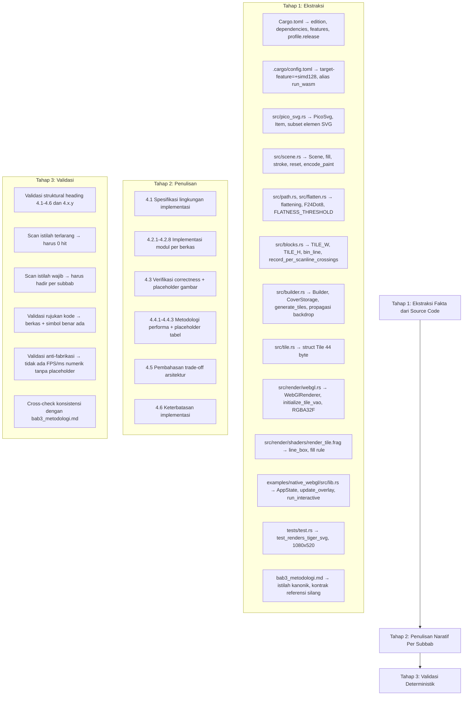
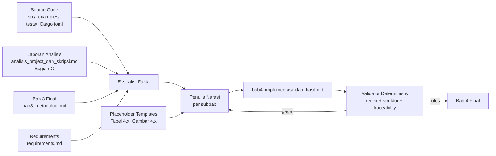

# Design Document: Penulisan Bab 4 Implementasi dan Hasil

## Overview

Dokumen desain ini mendeskripsikan pendekatan sistematis untuk menulis berkas `Skripsi/bab4_implementasi_dan_hasil.md` dari nol, menggantikan placeholder lorem ipsum yang menempati seluruh berkas saat ini. Output akhir adalah satu berkas Markdown tunggal yang berisi narasi akademik berbahasa Indonesia formal yang mendeskripsikan implementasi pustaka Arabella (`src/`, `examples/`, `tests/`, `Cargo.toml`, `.cargo/config.toml`) beserta hasil verifikasi correctness, metodologi pengujian performa, pembahasan trade-off arsitektur, dan keterbatasan implementasi.

Pendekatan penulisan mengikuti prinsip yang sudah dipakai pada spec `revisi-bab3-metodologi`, yaitu **source-of-truth-driven writing**: setiap klaim teknis pada Bab 4 ditulis berdasarkan pembacaan langsung terhadap source code, bukan berdasarkan asumsi atau memori. Setiap nama struct, nama fungsi, nama konstanta, nama feature flag, atau nilai parameter numerik harus muncul secara literal pada berkas yang dirujuk pada `src/`, `examples/`, `tests/`, `assets/`, `Cargo.toml`, atau `.cargo/config.toml`. Klaim yang tidak dapat ditelusuri ke source code tidak boleh dimasukkan ke dokumen.

Karena Bab 4 melaporkan dua kelas konten yang berbeda — (a) deskripsi implementasi (yang sudah dapat ditulis sekarang berdasarkan source code) dan (b) hasil pengujian performa (yang membutuhkan pengukuran empiris yang belum dilakukan) — desain ini memisahkan dua jenis konten secara tegas. Konten kategori (a) ditulis sebagai narasi padat dengan rujukan kode inline; konten kategori (b) ditulis sebagai struktur naratif lengkap dengan placeholder eksplisit berformat `[Tabel 4.x — diisi setelah pengujian dilakukan]` dan `[Gambar 4.x: deskripsi — dimasukkan kemudian]` agar tidak ada angka karangan yang masuk ke dokumen final.

### Keputusan Desain Utama

1. **Source-of-truth-driven writing** — Setiap klaim teknis pada Subbab 4.1 dan 4.2 wajib disertai rujukan kode berformat `berkas:simbol` atau `berkas:start-end` yang dapat diverifikasi langsung pada repositori.
2. **Pemisahan tegas antara konten siap-tulis dan konten tunggu-pengukuran** — Subbab 4.1, 4.2, 4.5, dan 4.6 ditulis penuh berdasarkan source code. Subbab 4.3 dan 4.4 ditulis sebagai narasi metodologi lengkap dengan placeholder eksplisit untuk gambar hasil rendering dan tabel pengukuran performa.
3. **Konsistensi terminologi dengan Bab 3** — Istilah kanonik (`pipeline hibrida`, `binning DDA`, `akumulator signed-area`, `propagasi backdrop`, `pra-pemrosesan`, `fragment shader`) dipakai persis seperti pada `bab3_metodologi.md` agar referensi silang antar bab tetap koheren.
4. **Eliminasi total istilah terlarang** — Istilah yang sudah dilarang pada Spec_Bab3 (`Ray Shooting`, `TileType`, label tipe ubin `EMPTY`/`INTERIOR`/`EDGE`, `fungsi implisit linear`, `PPGA`, `OpenGL ES 3.0 ditranspilasikan`, `edisi 2021`) tidak boleh muncul pada Bab 4.
5. **Anti-fabrikasi numerik** — Tidak ada angka FPS, CPU ms, GPU ms, atau metrik performa lain yang dimasukkan ke dokumen kecuali berasal dari pengukuran aktual atau berasal dari konstanta kode yang dirujuk.
6. **Gaya bahasa konsisten Bab 1–3** — Bahasa Indonesia formal akademik, kalimat lengkap S-P-O, istilah teknis berbahasa Inggris dalam format italic atau backtick.

## Architecture

Arsitektur proses penulisan Bab 4 terdiri atas pipeline tiga tahap yang dieksekusi secara sekuensial. Tahap 1 mengekstrak fakta teknis dari source code dan mengumpulkan rujukan kode yang sudah dipakai pada Bab 3. Tahap 2 menulis konten naratif per subbab berdasarkan fakta yang diekstrak, dengan menyisipkan placeholder eksplisit pada bagian yang membutuhkan pengukuran empiris. Tahap 3 memvalidasi output melalui pencarian teks deterministik untuk memastikan kehadiran istilah wajib, ketiadaan istilah terlarang, kelengkapan heading, dan ketertelusuran setiap klaim teknis.



### Aliran Data



### Strategi Pemisahan Konten Siap-Tulis dan Konten Tunggu-Pengukuran

Subbab Bab 4 tidak homogen dalam kesiapan datanya. Tabel berikut memetakan setiap Subbab_Wajib ke kelas kontennya dan strategi penulisan yang dipakai.

| Subbab | Kelas Konten | Strategi |
|---|---|---|
| 4.1 Spesifikasi Lingkungan Implementasi | Siap-tulis | Tulis penuh dari `Cargo.toml`, `.cargo/config.toml`, `examples/run_wasm/Cargo.toml`. |
| 4.2.1 Parser SVG | Siap-tulis | Tulis penuh dari `src/pico_svg.rs`. |
| 4.2.2 Scene API | Siap-tulis | Tulis penuh dari `src/scene.rs`. |
| 4.2.3 Path Processing dan Flattening | Siap-tulis | Tulis penuh dari `src/path.rs`, `src/flatten.rs`. |
| 4.2.4 Tile Binning DDA | Siap-tulis | Tulis penuh dari `src/blocks.rs`. |
| 4.2.5 Pembangkit Tile dan Akumulator Backdrop | Siap-tulis | Tulis penuh dari `src/builder.rs`. |
| 4.2.6 Renderer WebGL | Siap-tulis | Tulis penuh dari `src/render/webgl.rs`. |
| 4.2.7 Shader Vertex dan Fragment | Siap-tulis | Tulis penuh dari `src/render/shaders/render_tile.{vert,frag}`. |
| 4.2.8 Demo Interaktif | Siap-tulis | Tulis penuh dari `examples/native_webgl/src/{lib,main}.rs`. |
| 4.3 Verifikasi Kebenaran Output | Tunggu-pengukuran | Tulis narasi metodologi verifikasi + placeholder gambar untuk hasil rendering tiap aset. |
| 4.4.1 Metodologi Pengukuran | Siap-tulis | Tulis penuh dari `examples/native_webgl/src/lib.rs:AppState::render` dan `tests/test.rs`. |
| 4.4.2 Hasil Pengukuran Per Aset | Tunggu-pengukuran | Tulis kerangka tabel + placeholder `[Tabel 4.x — diisi setelah pengujian dilakukan]`. |
| 4.4.3 Analisis Perbandingan dengan Baseline | Hibrida | Tulis perbandingan kualitatif + disclaimer eksplisit bahwa benchmark kuantitatif belum dilakukan. |
| 4.5 Pembahasan Trade-off Arsitektur Non-Compute | Siap-tulis | Tulis penuh dari informasi Bab 2 (Subbab 2.2.3, 2.2.4, 2.2.8) tanpa angka karangan. |
| 4.6 Keterbatasan Implementasi Saat Ini | Siap-tulis | Tulis penuh dari TODO di kode + deklarasi feature opsional di `Cargo.toml`. |

## Components and Interfaces

### Komponen 1: Ekstraktor Fakta Source Code

**Tanggung jawab.** Membaca berkas-berkas source code, manifest, dan konfigurasi pada repositori, kemudian mengekstrak fakta teknis terstruktur yang akan menjadi basis kalimat per subbab pada Bab 4. Komponen ini juga membaca `Skripsi/bab3_metodologi.md` untuk memastikan istilah kanonik dan rujukan kode yang dipakai pada Bab 4 selaras dengan Bab 3.

**Input.** Berkas pada `src/`, `examples/native_webgl/src/`, `examples/run_wasm/`, `tests/`, `assets/`, `Cargo.toml`, `.cargo/config.toml`, dan `Skripsi/bab3_metodologi.md`.

**Output.** Daftar fakta terstruktur per subbab target (lihat Data Model 1).

**Pemetaan berkas sumber → subbab target.**

| Berkas Sumber | Subbab Target | Fakta yang Diekstrak |
|---|---|---|
| `Cargo.toml` (`[package]`) | 4.1 | `edition = "2024"`, `name = "arabella"`, `version`, lisensi |
| `Cargo.toml` (`[dependencies]`) | 4.1, 4.2.1–4.2.8 | sepuluh crate wajib + versinya |
| `Cargo.toml` (`[features]`) | 4.1, 4.6 | `default = ["std", "png"]`, `multithreading` opsional, `webgl` |
| `Cargo.toml` (`[profile.release]`) | 4.1 | `lto = "fat"`, `codegen-units = 1`, `panic = "abort"`, `overflow-checks = false`, `strip = true` |
| `Cargo.toml` (`[target.'cfg(target_arch = "wasm32")'.dependencies]`) | 4.1, 4.2.6 | `web-sys` features WebGL2, `wasm-bindgen`, `js-sys` |
| `.cargo/config.toml` | 4.1 | `target-feature=+simd128`, alias `run_wasm` |
| `examples/run_wasm/Cargo.toml` | 4.1 | `cargo-run-wasm = "0.4.0"` |
| `examples/native_webgl/Cargo.toml` | 4.1, 4.2.8 | crate-type `cdylib + rlib`, dependensi demo |
| `src/pico_svg.rs` | 4.2.1 | struct `PicoSvg`, enum `Item` (`Fill`, `Stroke`, `Group`), `Parser::rec_parse`, subset `g`, `path` |
| `src/scene.rs` | 4.2.2 | struct `Scene`, `Scene::new`, `Scene::fill` (line 70), `Scene::stroke` (line 117), `Scene::reset` (line 165), `encode_paint`, `PAINT_TYPE_SOLID`, delegasi `kurbo::stroke_with` |
| `src/path.rs` | 4.2.3 | `transform_pair`, `transform_quad` SIMD, `convert_cubics_to_quadratic_curves` (line 391), `estimate_number_of_quadratic_curves` (line 352), `MAX_QUADS = 16`, `TOL = 0.25`, `f32_to_f24dot8` |
| `src/flatten.rs` | 4.2.3 | `flatten_quadratic`, `flatten_recursive`, `is_flat_enough`, `FLATNESS_THRESHOLD = 32` |
| `src/blocks.rs` | 4.2.4 | `TILE_W = 16`, `TILE_H = 8`, `TILE_W_F24DOT8 = 4096`, `TILE_H_F24DOT8 = 2048`, struct `Block`, `Blocks`, `TileBounds`, `bin_line` (line 107), empat varian `outer_dda_*`, empat varian `inner_dda_*`, `record_per_scanline_crossings` (line 710) |
| `src/builder.rs` | 4.2.5 | struct `Builder`, `CoverStorage`, `Builder::build_path` (line 84), `Builder::generate_tiles` (line 151), propagasi `acc_arr: [i16; 8]`, SIMD `i16x8.add`, `FILL_RULE_NONZERO = 0`, `FILL_RULE_EVENODD = 1`, `FILL_RULE_SHIFT = 24` |
| `src/render/webgl.rs` | 4.2.6 | struct `WebGlRenderer` (line 265), `WebGlRenderer::new` (line 271), `WebGlRenderer::render` (line 296), `initialize_tile_vao` (line 525), stride 44 byte (line 529), `upload_data_to_rgba32f_texture` (line 423), `draw_arrays_instanced(TRIANGLE_STRIP, 0, 4, ...)` (line 393) |
| `src/render/shaders/render_tile.vert` | 4.2.7 | vertex shader instanced quad, pemetaan ke NDC |
| `src/render/shaders/render_tile.frag` | 4.2.7 | `WINDING_UNIT = 256.0` (line 24), `line_box` (line 90), `read_backdrop`, fill rule NonZero (line 215) dan EvenOdd (line 218–219), `PAINT_TYPE_SOLID` (line 11) |
| `src/tile.rs` | 4.2.6, 4.2.7 | struct `Tile` `#[repr(C)]` (line 9–23) total 44 byte, field `backdrop: [i16; 8]`, `segments: [f32; 2]`, `paint_and_rect_flag` |
| `examples/native_webgl/src/lib.rs` | 4.2.8, 4.4.1 | fungsi `run_interactive`, struct `AppState`, `AppState::render`, `AppState::update_overlay`, empat metrik overlay (CPU ms, GPU ms, ops, zoom), tiga aset uji |
| `examples/native_webgl/src/main.rs` | 4.1, 4.2.8 | entry point wasm, DPR-aware sizing |
| `tests/test.rs` | 4.3, 4.4.1 | `test_renders_tiger_svg` (line 147), `W = 1080`, `H = 520`, harness `wasm-bindgen-test` |
| `assets/*.svg` | 4.3 | tiga aset uji: `Ghostscript_Tiger.svg`, `SVG_Logo.svg`, `bismillah.svg` |
| `Skripsi/bab3_metodologi.md` | seluruh subbab | istilah kanonik, kontrak referensi silang ke Subbab 3.4.2, 3.4.3, 3.4.4 |

### Komponen 2: Penulis Narasi Per Subbab

**Tanggung jawab.** Menulis konten Markdown setiap subbab Bab 4 berdasarkan fakta yang diekstrak Komponen 1, dengan memperhatikan: (a) eliminasi seluruh istilah terlarang; (b) penyisipan istilah wajib pada konteks yang tepat; (c) penyertaan rujukan kode pada setiap klaim teknis; (d) konsistensi terminologi kanonik antar subbab; (e) penyisipan placeholder eksplisit pada bagian yang membutuhkan pengukuran empiris.

**Strategi penulisan per subbab.**

| Subbab | Strategi Naratif |
|---|---|
| 4.1 Spesifikasi Lingkungan Implementasi | Tulis lima paragraf: (1) bahasa dan edisi Rust (`Cargo.toml:7`), (2) target eksekusi `wasm32-unknown-unknown` + SIMD128 (`.cargo/config.toml`), (3) parameter profil release (`Cargo.toml [profile.release]`), (4) peramban target Chrome dengan dukungan WebGL 2.0 dan WASM SIMD128, (5) toolchain `wasm-pack` untuk pengujian dan `cargo-run-wasm` untuk demo (`examples/run_wasm/Cargo.toml`). |
| 4.2.1 Parser SVG | Tulis empat paragraf: (1) struct `PicoSvg` dan `PicoSvg::load` (`src/pico_svg.rs:84`); (2) enum `Item` tiga varian `Fill`, `Stroke`, `Group`; (3) dispatch tag-name `Parser::rec_parse` yang hanya menangani `g` dan `path` plus arm fallback (`src/pico_svg.rs:228`); (4) atribut presentation yang diparse (`fill`, `stroke`, `stroke-width`, `transform`) dan delegasi ke `roxmltree`. |
| 4.2.2 Scene API | Tulis tiga paragraf: (1) struct `Scene` dan field `width`, `height`, `builder`, `paint_index_counter` (`src/scene.rs:35-41`); (2) method publik `Scene::new`, `Scene::fill` (`src/scene.rs:70`), `Scene::stroke` (`src/scene.rs:117`), `Scene::reset` (`src/scene.rs:165`); (3) `encode_paint` untuk solid color via `PAINT_TYPE_SOLID = 0` (`src/scene.rs:22`) dan delegasi stroke expansion ke `kurbo::stroke_with`. |
| 4.2.3 Path Processing dan Flattening | Tulis empat paragraf: (1) transformasi affine SIMD-batched `transform_pair` dan `transform_quad` dengan `f32x4`/`f32x8` (`src/path.rs`); (2) konversi cubic-to-quadratic via `estimate_number_of_quadratic_curves` (`src/path.rs:352-375`) dengan `MAX_QUADS = 16` dan `TOL = 0.25`, lalu `convert_cubics_to_quadratic_curves` (`src/path.rs:391-475`); (3) flattening kuadratik via `flatten_quadratic` (`src/flatten.rs:20-29`) dan rekursi `flatten_recursive` (`src/flatten.rs:31-58`) dengan uji `is_flat_enough` terhadap `FLATNESS_THRESHOLD = 32` (`src/flatten.rs:18`); (4) format F24Dot8 (24.8 fixed-point) via `f32_to_f24dot8`. |
| 4.2.4 Tile Binning DDA | Tulis lima paragraf: (1) konstanta `TILE_W = 16`, `TILE_H = 8` (`src/blocks.rs:6-7`) dan turunan F24Dot8-nya `TILE_W_F24DOT8 = 4096`, `TILE_H_F24DOT8 = 2048` (`src/blocks.rs:10-11`); (2) struct `Block` dengan endpoint F24Dot8 ubin-lokal dan indeks ubin global (`src/blocks.rs:21-39`); (3) `Blocks::build_block` (`src/blocks.rs:93`) dan empat varian outer DDA diagonal (`outer_dda_down_right`, `outer_dda_down_left`, `outer_dda_up_right`, `outer_dda_up_left`); (4) empat varian inner DDA (`inner_dda_right_down`, `inner_dda_right_up`, `inner_dda_left_down`, `inner_dda_left_up`); (5) `record_per_scanline_crossings` (`src/blocks.rs:710-757`) sebagai akumulator signed-area 8.8 fixed-point per scanline dengan `saturating_add` i16. |
| 4.2.5 Pembangkit Tile dan Akumulator Backdrop | Tulis empat paragraf: (1) struct `Builder` dan field `tiles`, `segments`, `line_buf`, `blocks`, `covers`, `bbox` (`src/builder.rs:36-54`); (2) struct `CoverStorage` dengan `tag` bit-vektor dan `backdrops: Vec<[i16; TILE_H]>` (`src/builder.rs:360-369`); (3) `Builder::build_path` (`src/builder.rs:84`) sebagai entry point flattening + binning; (4) `Builder::generate_tiles` (`src/builder.rs:151-337`) dengan propagasi backdrop kiri-ke-kanan, gerbang emisi `tagged \|\| acc_nonzero`, dan optimasi SIMD `i16x8.add`. |
| 4.2.6 Renderer WebGL | Tulis empat paragraf: (1) struct `WebGlRenderer` dengan `programs` dan `gl: WebGl2RenderingContext` (`src/render/webgl.rs:265-269`); (2) `WebGlRenderer::new` (`src/render/webgl.rs:271`) dan kompilasi shader; (3) `initialize_tile_vao` (`src/render/webgl.rs:525`) dengan stride 44 byte yang ditetapkan dari `core::mem::size_of::<Tile>()` (`src/render/webgl.rs:529`) dan `vertexAttribDivisor(_, 1)` untuk seluruh enam slot atribut; (4) `WebGlRenderer::render` (`src/render/webgl.rs:296`) dengan upload tekstur RGBA32F via `upload_data_to_rgba32f_texture` (`src/render/webgl.rs:423-446`) dan `draw_arrays_instanced(TRIANGLE_STRIP, 0, 4, tiles.len())` (`src/render/webgl.rs:393-398`). |
| 4.2.7 Shader Vertex dan Fragment | Tulis tiga paragraf: (1) vertex shader `render_tile.vert` instanced quad yang memetakan `(x, y, width, height)` ubin ke NDC dan meneruskan atribut backdrop, offset segmen, paint flag ke fragment shader; (2) fragment shader `render_tile.frag` membaca backdrop per scanline (dibagi `WINDING_UNIT = 256.0` di `src/render/shaders/render_tile.frag:24`) dan mengakumulasi kontribusi `line_box` (integral trapezoidal cakupan piksel) untuk setiap segmen via loop sekuensial (`src/render/shaders/render_tile.frag:90`); (3) penerapan fill rule NonZero `coverage = clamp(abs(winding), 0.0, 1.0)` (`src/render/shaders/render_tile.frag:215`) dan EvenOdd `coverage = 1.0 - abs(mod(abs(winding), 2.0) - 1.0)` (`src/render/shaders/render_tile.frag:218-219`). |
| 4.2.8 Demo Interaktif | Tulis empat paragraf: (1) entry point `run_interactive(width, height)` di `examples/native_webgl/src/lib.rs` dipanggil dari `main.rs` setelah membaca `device_pixel_ratio()`, `inner_width()`, `inner_height()`; (2) struct `AppState` (asset list, view transform, scene, renderer, FPS window) dan `AppState::render` yang mengukur `last_cpu_ms` dan `last_gpu_ms` melalui `performance.now()`; (3) `AppState::update_overlay` (`examples/native_webgl/src/lib.rs:316-341`) dipanggil setiap sepuluh frame dengan empat metrik (FPS rerata, CPU ms, GPU ms, zoom, ops); (4) tiga aset uji yang dimuat (`Ghostscript Tiger`, `SVG Logo`, `Bismillah`) dan event handler `mouse_down`, `mouse_up`, `mouse_move`, `wheel`, `keyboard` (pan, zoom, reset, perpindahan adegan). |
| 4.3 Verifikasi Kebenaran Output | Tulis empat paragraf: (1) tiga aset uji `assets/Ghostscript_Tiger.svg`, `assets/SVG_Logo.svg`, `assets/bismillah.svg` beserta placeholder gambar `[Gambar 4.x: Hasil rendering {nama aset} oleh Arabella — dimasukkan kemudian]` per aset; (2) aspek correctness yang diverifikasi: fill solid color, stroke expansion via `kurbo::stroke_with`, fill rule NonZero, ketiadaan artefak streak/seam pada batas ubin; (3) pengujian otomatis `wasm-bindgen-test` pada `tests/test.rs:test_renders_tiger_svg` (`tests/test.rs:147`); (4) validasi visual manual dengan membandingkan output Arabella terhadap rendering peramban (SVG native rendering) pada aset yang sama. |
| 4.4.1 Metodologi Pengukuran | Tulis tiga paragraf: (1) penggunaan `performance.now()` pada blok pra-pemrosesan CPU dan blok rasterisasi GPU secara terpisah di `AppState::render` (`examples/native_webgl/src/lib.rs`), sampling 60-frame rolling average untuk FPS via `fps_window: Vec<f64>`; (2) resolusi pengujian: demo interaktif window-fill DPR-aware (rumus `width = inner_width × devicePixelRatio` di `examples/native_webgl/src/main.rs:22-27`), tes otomatis kanvas tetap 1080×520 piksel pada DPR 1.0 (`tests/test.rs:151-152`); (3) mekanisme isolasi CPU/GPU: `Scene::fill` dan `Scene::stroke` mendelegasikan ke `Builder::build_path` di blok CPU; `WebGlRenderer::render` mengeksekusi upload + `draw_arrays_instanced` di blok GPU. |
| 4.4.2 Hasil Pengukuran Per Aset | Tulis kerangka satu paragraf naratif yang mengantarkan tabel; sisipkan `[Tabel 4.x — Hasil pengukuran performa per aset — diisi setelah pengujian dilakukan]` dengan daftar kolom eksplisit (Aset, Paint Ops, CPU ms, GPU ms, Total Frame Time ms, FPS); jangan masukkan angka apapun. |
| 4.4.3 Analisis Perbandingan dengan Baseline | Tulis dua paragraf: (1) perbandingan kualitatif terhadap Skia (CPU-centric SIMD), Cairo (CPU-centric scanline), dan Vello (GPU compute-centric) merujuk Subbab 2.2.3, 2.2.4, 2.2.8 pada Bab 2; (2) disclaimer eksplisit bahwa benchmark kuantitatif langsung terhadap renderer lain belum dilakukan pada implementasi saat ini, dan bahwa data Tabel 4.x perlu dilengkapi sebelum perbandingan kuantitatif dapat ditarik. |
| 4.5 Pembahasan Trade-off Arsitektur Non-Compute | Tulis tiga paragraf yang masing-masing membahas satu dimensi trade-off: (a) kompatibilitas platform (WebGL 2.0 di lebih banyak perangkat dibanding WebGPU/compute shader), (b) kompleksitas implementasi (beban pra-pemrosesan di CPU vs compute shader dispatch), (c) karakteristik performa (latensi transfer CPU→GPU vs paralelisme GPU penuh). Tutup dengan satu paragraf rekapitulasi: pendekatan Arabella mengeliminasi ketergantungan compute shader dengan konsekuensi seluruh komputasi tujuan umum (flattening, binning, akumulator winding) dieksekusi di CPU. |
| 4.6 Keterbatasan Implementasi Saat Ini | Tulis enam butir poin daftar dengan rujukan kode masing-masing: (a) gradien linear/radial/sweep belum aktif di fragment shader (`src/scene.rs:encode_paint` mengembalikan `PAINT_TYPE_SOLID`); (b) image paint dan tinting belum diunggah dari Scene (`src/render/common.rs:GpuEncodedImage`); (c) Rayon belum diaktifkan pada hot path (`Cargo.toml:[features].multithreading` opsional); (d) subset SVG terbatas pada `path`, `g`, `fill`, `stroke`, `transform` (`src/pico_svg.rs:191`); (e) tiada sistem text rendering; (f) tiada filter effect (blur, drop shadow). Tutup dengan satu paragraf yang menyatakan bahwa keterbatasan tersebut merupakan future work dan tidak mengurangi validitas kontribusi inti penelitian (pipeline hibrida non-compute). |

### Komponen 3: Validator Deterministik Pasca-Tulis

**Tanggung jawab.** Memverifikasi bahwa berkas output `Skripsi/bab4_implementasi_dan_hasil.md` memenuhi seluruh constraint requirements melalui pencarian teks deterministik dan pemeriksaan struktural. Validator ini tidak membutuhkan eksekusi kode aplikasi; ia hanya membaca berkas Markdown output dan struktur repositori.

**Prosedur validasi.**

1. **Validasi Struktural Heading (Req 1, 2):** Verifikasi baris pertama berkas adalah literal `# BAB 4 HASIL DAN PEMBAHASAN`; verifikasi kehadiran tepat satu kali untuk setiap heading wajib dengan teks persis case-sensitive; verifikasi urutan menaik monotonik 4.1 → 4.6 untuk heading level 2; verifikasi urutan menaik monotonik untuk subheading 4.x.y di bawah induknya.
2. **Validasi Eliminasi Istilah Terlarang (Req 11):** Jalankan pencarian regex untuk setiap istilah terlarang yang sudah didefinisikan pada Spec_Bab3 dan diteruskan oleh Bab 4. Kondisi PASS = 0 kemunculan.
3. **Validasi Kehadiran Istilah Wajib (Req 3, 4, 5, 6, 7, 8, 11):** Jalankan pencarian untuk setiap istilah wajib pada subbab yang ditentukan. Kondisi PASS = minimal satu kemunculan per istilah pada subbab yang tepat.
4. **Validasi Anti-Fabrikasi Numerik (Req 6, 10):** Jalankan pencarian regex untuk pola angka FPS, CPU ms, GPU ms (`\d+(\.\d+)?\s*(fps|ms)`) di Subbab 4.4.2 dan 4.4.3. Kondisi PASS = setiap kemunculan nilai numerik baik berada di dalam Placeholder_Numerik berformat `[Tabel 4.x — ... diisi ...]` atau berasal dari konstanta kode yang dirujuk (misalnya `1080×520`, `44 byte`, `16×8`).
5. **Validasi Rujukan Kode (Req 9):** Untuk setiap klaim teknis pada Subbab 4.1, 4.2.1–4.2.8, dan 4.6, verifikasi bahwa terdapat minimal satu rujukan kode berformat `berkas:simbol` atau `berkas:start-end`; verifikasi bahwa berkas yang ditunjuk benar-benar ada di repositori dan simbol yang dirujuk benar-benar terdefinisi pada berkas tersebut.
6. **Validasi Konsistensi Terminologi Lintas-Bab (Req 11, 12):** Verifikasi bahwa istilah kanonik (`pipeline hibrida`, `binning DDA`, `akumulator signed-area`, `propagasi backdrop`, `pra-pemrosesan` atau `preprocessing`, `fragment shader`) digunakan secara konsisten; verifikasi tidak ada paragraf yang mencampur `pra-pemrosesan` dan `preprocessing`; verifikasi bahwa kalimat penghubung ke Bab 3 hadir pada paragraf pembuka Subbab 4.1 atau 4.2.
7. **Validasi Single-File Output (Req 1):** Verifikasi bahwa satu-satunya berkas pada repositori yang baris pertamanya adalah `# BAB 4 HASIL DAN PEMBAHASAN` adalah `Skripsi/bab4_implementasi_dan_hasil.md`.
8. **Validasi Lorem Ipsum (Req 1):** Verifikasi bahwa string `Lorem ipsum`, `dolor sit amet`, `consectetur adipiscing` (case-insensitive) tidak muncul di berkas output.

## Data Models

### Model 1: Fakta Teknis (Intermediate Representation)

Setiap fakta yang diekstrak dari source code direpresentasikan sebagai tuple konseptual:

```
FaktaTeknis {
    subbab_target: String,      // misalnya "4.2.4", "4.4.1"
    kategori: enum {Algoritma, StrukturData, Parameter, Fungsi, Dependensi, Perilaku, Resolusi},
    klaim_naratif: String,      // kalimat yang akan ditulis di Bab 4
    rujukan_kode: String,       // misalnya "src/blocks.rs:TILE_W" atau "src/builder.rs:151"
    berkas_sumber: String,      // path relatif yang membuktikan klaim
}
```

### Model 2: Struktur Heading Bab 4

Struktur heading yang harus dihasilkan oleh penulis (Komponen 2) dan diverifikasi oleh validator (Komponen 3):

```
HeadingTree {
    level_1: "# BAB 4 HASIL DAN PEMBAHASAN"
    children: [
        {level_2: "## 4.1 Spesifikasi Lingkungan Implementasi"},
        {level_2: "## 4.2 Implementasi Modul", children: [
            {level_3: "### 4.2.1 Parser SVG"},
            {level_3: "### 4.2.2 Scene API"},
            {level_3: "### 4.2.3 Path Processing dan Flattening"},
            {level_3: "### 4.2.4 Tile Binning DDA"},
            {level_3: "### 4.2.5 Pembangkit Tile dan Akumulator Backdrop"},
            {level_3: "### 4.2.6 Renderer WebGL"},
            {level_3: "### 4.2.7 Shader Vertex dan Fragment"},
            {level_3: "### 4.2.8 Demo Interaktif"},
        ]},
        {level_2: "## 4.3 Verifikasi Kebenaran Output"},
        {level_2: "## 4.4 Pengujian Performa", children: [
            {level_3: "### 4.4.1 Metodologi Pengukuran"},
            {level_3: "### 4.4.2 Hasil Pengukuran Per Aset"},
            {level_3: "### 4.4.3 Analisis Perbandingan dengan Baseline"},
        ]},
        {level_2: "## 4.5 Pembahasan Trade-off Arsitektur Non-Compute"},
        {level_2: "## 4.6 Keterbatasan Implementasi Saat Ini"},
    ]
}
```

### Model 3: Istilah Wajib per Subbab

Daftar istilah wajib yang harus muncul minimal satu kali pada subbab yang ditentukan. Daftar ini diturunkan langsung dari acceptance criteria pada Requirements (Req 3–8) dan dipakai oleh Komponen 3 untuk validasi kehadiran.

| Subbab | Istilah Wajib |
|---|---|
| 4.1 | `Rust edisi 2024`, `wasm32-unknown-unknown`, `+simd128`, `WebGL 2.0`, `lto = "fat"`, `codegen-units = 1`, `panic = "abort"`, `overflow-checks = false`, `strip = true`, `wasm-pack`, `cargo-run-wasm` |
| 4.2.1 | `PicoSvg`, `Item`, `Fill`, `Stroke`, `Group`, `roxmltree`, `g`, `path`, `transform` |
| 4.2.2 | `Scene`, `Scene::new`, `Scene::fill`, `Scene::stroke`, `Scene::reset`, `encode_paint`, `kurbo::stroke_with` |
| 4.2.3 | `transform_pair`, `transform_quad`, `f32x4`, `f32x8`, `convert_cubics_to_quadratic_curves`, `estimate_number_of_quadratic_curves`, `flatten_quadratic`, `f32_to_f24dot8`, `FLATNESS_THRESHOLD` |
| 4.2.4 | `Block`, `Blocks`, `TileBounds`, `bin_line`, `bin_line_in_row`, `record_per_scanline_crossings`, `TILE_W = 16`, `TILE_H = 8`, `16×8` |
| 4.2.5 | `Builder`, `CoverStorage`, `Builder::build_path`, `Builder::generate_tiles`, `propagasi backdrop`, `i16x8` |
| 4.2.6 | `WebGlRenderer`, `WebGl2RenderingContext`, `create_shader_program` (atau ekuivalen yang ada di kode), `initialize_tile_vao`, `44 byte`, `RGBA32F` |
| 4.2.7 | `render_tile.vert`, `render_tile.frag`, `line_box`, `read_backdrop` (atau pembacaan backdrop), NDC, NonZero, EvenOdd, `clamp(abs(winding), 0, 1)`, `1 - abs(mod(`, `WINDING_UNIT` |
| 4.2.8 | `run_interactive`, `requestAnimationFrame`, `Ghostscript Tiger`, `SVG Logo`, `Bismillah`, `update_overlay` (atau ekuivalen yang ada di kode), pan, zoom, FPS, CPU ms, GPU ms |
| 4.3 | `Ghostscript_Tiger.svg`, `SVG_Logo.svg`, `bismillah.svg`, `wasm-bindgen-test`, `test_renders_tiger_svg`, `tests/test.rs` |
| 4.4.1 | `performance.now()`, `60-frame rolling average`, `1080×520`, DPR-aware |
| 4.4.2 | `[Tabel 4.x` (placeholder), Aset, Paint Ops, CPU ms, GPU ms, FPS |
| 4.4.3 | Skia, Cairo, Vello, disclaimer benchmark |
| 4.5 | `pipeline hibrida`, WebGL 2.0, WebGPU, compute shader, CPU, GPU |
| 4.6 | gradien, `PAINT_TYPE_SOLID`, image paint, Rayon, `multithreading`, subset SVG, text rendering, filter effect, future work |

### Model 4: Istilah Terlarang (Diteruskan dari Spec_Bab3)

Istilah berikut TIDAK BOLEH muncul pada Bab 4. Daftar ini sama persis dengan daftar pada `revisi-bab3-metodologi/design.md` (Data Model 3), karena Bab 4 wajib menjaga konsistensi terminologi lintas-bab dengan Bab 3 yang sudah direvisi.

| Istilah Terlarang | Pengganti yang Wajib Dipakai di Bab 4 |
|---|---|
| Ray Shooting / ray shoot | binning DDA dua tahap + akumulator signed-area per scanline |
| EMPTY / INTERIOR / EDGE (sebagai label tipe ubin) | ubin nontrivial vs ubin trivial (yang tidak diemit) |
| TileType | (dihapus, tidak ada enum tipe ubin pada source code) |
| `winding_number` (sebagai field skalar `Tile`) | `backdrop: [i16; 8]` (delapan akumulator per scanline) |
| fungsi implisit linear `ax+by+c` | integral trapezoidal cakupan piksel `line_box` |
| fungsi implisit kuadratik kanonik `f(u,v)=u-v²` | flattening kuadratik ke segmen garis di CPU |
| fungsi implisit kubik PPGA / Projective Geometric Algebra | konversi kubik → kuadratik → garis di CPU |
| `C(x,y)=0` | akumulasi winding via `line_box` lalu fill rule |
| OpenGL ES 3.0 ditranspilasikan ke WebGL 2.0 | WebGL 2.0 sebagai target langsung |
| Rust edisi 2021 | Rust edisi 2024 |
| Lorem ipsum / dolor sit amet / consectetur adipiscing | (dihapus seluruhnya, diganti narasi substantif) |

### Model 5: Istilah Kanonik untuk Konsistensi Internal

Tabel berikut mendefinisikan satu-satunya bentuk istilah yang dipakai untuk komponen pipeline tertentu. Sinonim non-kanonik untuk komponen yang sama dilarang muncul di Bab 4. Istilah ini selaras dengan Subbab 3.5 pada `bab3_metodologi.md`.

| Komponen Pipeline | Istilah Kanonik Tunggal |
|---|---|
| Pemecahan segmen lintas ubin | `binning DDA` |
| Akumulator winding 8.8 fixed-point per scanline | `akumulator signed-area` |
| Akumulasi kiri-ke-kanan saat emisi tile | `propagasi backdrop` |
| Shader piksel WebGL | `fragment shader` |
| Tahap CPU keseluruhan | `pra-pemrosesan` (boleh juga `preprocessing`, tapi tidak dicampur dalam paragraf yang sama) |
| Arsitektur keseluruhan | `pipeline hibrida` |
| Pipeline GPU | `rasterization pipeline tradisional` atau `pipeline rasterisasi konvensional` |
| Wilayah layar target | `viewport` |
| Akumulator pengintegrasi area garis | `winding number` (sebagai konsep, bukan field skalar `Tile`) |

### Model 6: Format Placeholder Eksplisit

Bab 4 mengandung dua kelas placeholder eksplisit untuk konten yang membutuhkan pengukuran empiris atau aset visual yang belum tersedia. Format kedua kelas placeholder ini ditetapkan sebagai berikut, dan Komponen 3 (Validator) memeriksa kesesuaiannya.

| Kelas Placeholder | Format Wajib | Lokasi Penggunaan |
|---|---|---|
| Tabel data empiris | `[Tabel 4.x — Hasil pengukuran performa per aset — diisi setelah pengujian dilakukan]` atau `[Tabel 4.x — deskripsi — diisi setelah pengujian dilakukan]` | Subbab 4.4.2 |
| Gambar hasil rendering | `[Gambar 4.x: Hasil rendering {nama aset} oleh Arabella — dimasukkan kemudian]` | Subbab 4.3 (per aset uji) |
| Gambar lain (diagram modul, screenshot demo) | `[Gambar 4.x: deskripsi — dimasukkan kemudian]` | Subbab 4.2.x dan 4.4.1 jika diperlukan |
| Nilai numerik tunggal | `[Nilai — diisi setelah pengukuran]` | Tidak digunakan jika placeholder tabel sudah mencakup nilai tersebut |

### Model 7: Pemetaan Acceptance Criteria → Subbab → Validasi

Tabel ini memberikan pemetaan terbalik dari setiap acceptance criterion pada `requirements.md` ke subbab Bab 4 yang menanganinya, dan ke metode validasi yang dipakai Komponen 3. Tabel ini dipakai sebagai checklist akhir sebelum menyatakan Bab 4 selesai.

| Req AC | Subbab Penanganan | Metode Validasi |
|---|---|---|
| 1.1, 1.2, 1.3, 1.4, 1.5 | Seluruh berkas | Validasi struktural + lorem ipsum + single-file |
| 2.1–2.8 | Seluruh heading | Validasi struktural heading |
| 3.1–3.5 | 4.1 | Validasi kehadiran istilah wajib + rujukan kode |
| 4.1–4.8 | 4.2.1–4.2.8 | Validasi kehadiran istilah wajib + rujukan kode |
| 5.1–5.5 | 4.3 | Validasi kehadiran istilah wajib + format placeholder gambar |
| 6.1–6.5 | 4.4.1–4.4.3 | Validasi kehadiran istilah wajib + anti-fabrikasi numerik + format placeholder tabel |
| 7.1–7.3 | 4.5 | Validasi kehadiran istilah wajib (Skia, Cairo, Vello, compute shader) |
| 8.1–8.3 | 4.6 | Validasi kehadiran enam butir keterbatasan + rujukan kode |
| 9.1–9.4 | Seluruh klaim teknis | Validasi rujukan kode (berkas + simbol benar ada) |
| 10.1–10.4 | 4.4.2, 4.4.3 | Validasi anti-fabrikasi numerik |
| 11.1–11.5 | Seluruh berkas | Validasi konsistensi terminologi + eliminasi istilah terlarang |
| 12.1–12.3 | 4.1 atau 4.2 (paragraf pembuka) | Validasi kalimat penghubung ke Bab 3 |
| 13.1–13.4 | Seluruh berkas | Validasi gaya bahasa + format placeholder |


## Correctness Properties

*A property is a characteristic or behavior that should hold true across all valid executions of a system — essentially, a formal statement about what the system should do. Properties serve as the bridge between human-readable specifications and machine-verifiable correctness guarantees.*

Spec ini menghasilkan satu berkas Markdown akademik (bukan kode yang dapat dieksekusi), sehingga properti di bawah ini tidak diuji melalui property-based testing dengan iterasi acak. Sebaliknya, setiap properti diformulasikan sebagai pernyataan terkuantifikasi universal terhadap konten berkas `Skripsi/bab4_implementasi_dan_hasil.md` dan struktur repositori, dan diverifikasi secara deterministik melalui pencarian teks (regex), pemeriksaan struktural, dan cross-referensi terhadap berkas pada Source_Of_Truth. Setiap properti dirancang agar dapat dievaluasi sebagai predikat boolean PASS/FAIL atas satu artefak dokumen.

### Property 1: Single-File Output Identity

*For all* jalur berkas pada repositori yang nama berkasnya mengandung substring `bab4`, `bab_4`, atau `bab-4` (pencocokan case-insensitive), satu-satunya berkas yang baris pertamanya adalah literal `# BAB 4 HASIL DAN PEMBAHASAN` adalah `Skripsi/bab4_implementasi_dan_hasil.md`; dan tidak ada salinan utuh, salinan parsial, cadangan, atau draf alternatif Bab 4 di lokasi lain manapun pada repositori; dan berkas tersebut memiliki ekstensi `.md`; dan parser CommonMark dapat menguraikan seluruh isinya tanpa galat sintaks.

**Validates: Requirements 1.1, 1.2, 1.3, 1.5**

### Property 2: Absence of Lorem Ipsum

*For all* substring pada `Skripsi/bab4_implementasi_dan_hasil.md`, tidak ada yang cocok dengan pola `Lorem ipsum`, `dolor sit amet`, `consectetur adipiscing`, `eiusmod tempor`, atau `Excepteur sint occaecat` (pencocokan case-insensitive).

**Validates: Requirements 1.4**

### Property 3: Structural Heading Invariant

*For every* heading `H` pada himpunan Subbab_Wajib (`4.1 Spesifikasi Lingkungan Implementasi`, `4.2 Implementasi Modul`, `4.2.1 Parser SVG`, `4.2.2 Scene API`, `4.2.3 Path Processing dan Flattening`, `4.2.4 Tile Binning DDA`, `4.2.5 Pembangkit Tile dan Akumulator Backdrop`, `4.2.6 Renderer WebGL`, `4.2.7 Shader Vertex dan Fragment`, `4.2.8 Demo Interaktif`, `4.3 Verifikasi Kebenaran Output`, `4.4 Pengujian Performa`, `4.4.1 Metodologi Pengukuran`, `4.4.2 Hasil Pengukuran Per Aset`, `4.4.3 Analisis Perbandingan dengan Baseline`, `4.5 Pembahasan Trade-off Arsitektur Non-Compute`, `4.6 Keterbatasan Implementasi Saat Ini`), `H` muncul tepat satu kali pada level Markdown yang ditentukan (`##` untuk subbab `4.X`, `###` untuk subbab `4.X.Y`) dengan teks persis case-sensitive yang ditetapkan; baris pertama berkas adalah literal `# BAB 4 HASIL DAN PEMBAHASAN`; nomor heading level 2 mengikuti urutan menaik monotonik 4.1 → 4.6 tanpa lompatan, pengulangan, atau pembalikan; dan setiap subheading `### 4.X.Y` muncul setelah induknya `## 4.X` dan sebelum `## 4.(X+1)` dengan `Y` menaik monotonik mulai dari 1.

**Validates: Requirements 1.3, 2.1, 2.2, 2.3, 2.4, 2.5, 2.6, 2.7, 2.8**

### Property 4: Absence of Forbidden Terms

*For all* istilah terlarang `T` pada himpunan Istilah_Terlarang (didefinisikan di Data Model 4 dan diturunkan dari Spec_Bab3), `T` TIDAK muncul pada konten `Skripsi/bab4_implementasi_dan_hasil.md` dalam konteks yang dilarang. Pemeriksaan mencakup pencarian case-insensitive untuk `Ray Shooting`, `Ray Shoot`, `ray shooting`, `ray shoot`; pencarian token kata utuh case-sensitive untuk `TileType`, `winding_number`, `PPGA`, `Projective Geometric Algebra`; pencarian token kata utuh case-sensitive untuk `EMPTY`, `INTERIOR`, `EDGE` ketika digunakan sebagai label tipe ubin; pencarian frasa untuk `fungsi implisit linear`, `fungsi implisit kuadratik kanonik`, `fungsi implisit kubik`, `OpenGL ES 3.0 yang ditranspilasikan`, `ditranspilasikan ke WebGL`, `transpilasi OpenGL ES`, `Rust edisi 2021`, `edisi 2021`, `edition = "2021"`; serta pencarian persamaan untuk seluruh varian `ax+by+c=0`, `u-v²=0`, `u-v^2=0`, `C(x,y)=0`, dan `w_0³-w_1 w_2 w_3` dengan atau tanpa spasi.

**Validates: Requirements 11.4**

### Property 5: Presence of Required Terms Per Subsection

*For every* pasangan (subbab `S`, istilah wajib `T`) pada himpunan Istilah_Wajib_Per_Subbab (didefinisikan di Data Model 3), `T` muncul minimal satu kali pada Subbab `S` di `Skripsi/bab4_implementasi_dan_hasil.md`. Himpunan ini mencakup minimal: pada Subbab 4.1 — `Rust edisi 2024`, `wasm32-unknown-unknown`, `+simd128`, `WebGL 2.0`, `lto = "fat"`, `codegen-units = 1`, `panic = "abort"`, `overflow-checks = false`, `strip = true`, `wasm-pack`, `cargo-run-wasm`, Chrome, `WASM SIMD128`; pada Subbab 4.2.1 — `PicoSvg`, `Item`, `Fill`, `Stroke`, `Group`, `roxmltree`, elemen `g`, elemen `path`, atribut `transform`; pada Subbab 4.2.2 — `Scene`, `Scene::new`, `Scene::fill`, `Scene::stroke`, `Scene::reset`, `encode_paint`, `kurbo::stroke_with`; pada Subbab 4.2.3 — `transform_pair`, `transform_quad`, `f32x4`, `f32x8`, `convert_cubics_to_quadratic_curves`, `estimate_number_of_quadratic_curves`, `flatten_quadratic`, `f32_to_f24dot8`, `FLATNESS_THRESHOLD`, `F24Dot8`; pada Subbab 4.2.4 — `Block`, `Blocks`, `TileBounds`, `bin_line`, `bin_line_in_row`, `record_per_scanline_crossings`, `TILE_W`, `TILE_H`, `16×8` piksel; pada Subbab 4.2.5 — `Builder`, `CoverStorage`, `Builder::build_path`, `Builder::generate_tiles`, `propagasi backdrop`, `i16x8`; pada Subbab 4.2.6 — `WebGlRenderer`, `WebGl2RenderingContext`, `initialize_tile_vao`, stride `44 byte`, `RGBA32F`, `draw_arrays_instanced`; pada Subbab 4.2.7 — `render_tile.vert`, `render_tile.frag`, `line_box`, NDC, NonZero, EvenOdd, `WINDING_UNIT`; pada Subbab 4.2.8 — `run_interactive`, `Ghostscript Tiger`, `SVG Logo`, `Bismillah`, FPS, CPU ms, GPU ms; pada Subbab 4.3 — `Ghostscript_Tiger.svg`, `SVG_Logo.svg`, `bismillah.svg`, `wasm-bindgen-test`, `test_renders_tiger_svg`, `tests/test.rs`, fill solid color, stroke expansion, fill rule NonZero, validasi visual; pada Subbab 4.4.1 — `performance.now()`, 60-frame rolling average, `1080×520`, DPR-aware; pada Subbab 4.4.3 — Skia, Cairo, Vello, disclaimer benchmark; pada Subbab 4.5 — `pipeline hibrida`, WebGL 2.0, WebGPU, compute shader, kompatibilitas platform, kompleksitas implementasi, karakteristik performa; pada Subbab 4.6 — gradien, `PAINT_TYPE_SOLID`, image paint, Rayon, `multithreading`, subset SVG, text rendering, filter effect, future work.

**Validates: Requirements 3.1, 3.2, 3.3, 3.4, 3.5, 4.1, 4.2, 4.3, 4.4, 4.5, 4.6, 4.7, 4.8, 5.1, 5.3, 5.4, 5.5, 6.1, 6.2, 6.5, 7.1, 7.2, 7.3, 8.1, 8.3**

### Property 6: Technical Claim Traceability

*For every* klaim teknis `K` di `Skripsi/bab4_implementasi_dan_hasil.md` (sesuai definisi Klaim_Teknis pada Glossary requirements: pernyataan yang menyebut nama algoritma/struktur data, parameter numerik konkret yang berasal dari konstanta kode, nama berkas/fungsi/struct/trait/modul/feature flag/konstanta, atau perilaku runtime spesifik), terdapat minimal satu rujukan kode `R` yang menyertai `K` dalam kalimat atau paragraf yang sama, dengan format jalur berkas relatif terhadap akar repositori ditambah salah satu dari nama fungsi, nama konstanta, nama struct, atau rentang baris (`path:simbol` atau `path:start-end`); dan untuk setiap `R`, berkas yang ditunjuk benar-benar ada di salah satu dari `src/`, `Cargo.toml`, `.cargo/config.toml`, `examples/*/src/`, `examples/*/Cargo.toml`, `tests/`, atau `assets/`, dan simbol yang dirujuk benar-benar terdefinisi pada berkas tersebut. Properti ini juga menyiratkan bahwa nama fungsi, nama struct, nama trait, nama modul, nama feature flag, nama crate, dan nilai parameter numerik yang muncul di Bab 4 muncul secara literal pada Source_Of_Truth.

**Validates: Requirements 8.2, 9.1, 9.2, 9.3, 9.4**

### Property 7: Numerical Anti-Fabrication

*For every* kemunculan pola numerik berunit performa `\d+(\.\d+)?\s*(fps|FPS|ms|MS|millisecond|milidetik)` pada `Skripsi/bab4_implementasi_dan_hasil.md`, kemunculan tersebut memenuhi salah satu dari dua kondisi: (a) berada di dalam Placeholder_Numerik yang berbentuk `[Tabel 4.x — ... diisi setelah pengujian dilakukan]` atau `[Nilai — diisi setelah pengukuran]` atau placeholder gambar, atau (b) merupakan nilai yang berasal dari konstanta kode yang dirujuk dengan rujukan kode pada paragraf yang sama (misalnya `1080×520` yang dirujuk ke `tests/test.rs:151-152`, `44 byte` yang dirujuk ke `src/tile.rs:9-23` atau `core::mem::size_of::<Tile>()`, `16×8` piksel yang dirujuk ke `src/blocks.rs:6-7`); dan tidak ada angka FPS, CPU ms, atau GPU ms yang muncul tanpa salah satu dari dua kondisi tersebut; dan tidak ada grafik atau tabel dengan data numerik performa yang diisi nilai tanpa label eksplisit yang menyatakan sifat estimatifnya.

**Validates: Requirements 6.4, 10.1, 10.2, 10.3, 10.4**

### Property 8: Canonical Terminology Consistency

*For every* komponen pipeline `C` pada himpunan istilah kanonik (didefinisikan di Data Model 5: `binning DDA`, `akumulator signed-area`, `propagasi backdrop`, `fragment shader`, `pra-pemrosesan` atau `preprocessing`, `pipeline hibrida`, `rasterization pipeline tradisional` atau `pipeline rasterisasi konvensional`, `viewport`, `winding number`), setiap kemunculan `C` di seluruh `Skripsi/bab4_implementasi_dan_hasil.md` menggunakan bentuk kanonik tersebut; tidak ada sinonim non-kanonik atau variasi ejaan untuk `C` yang muncul di subbab manapun; tidak ada satu paragraf tunggal yang mencampur `pra-pemrosesan` dan `preprocessing`; istilah `winding number` muncul sebagai konsep tetapi `winding_number` (dengan underscore) tidak muncul sebagai nama field; dan setiap istilah teknis berbahasa Inggris kanonik (`flatten`, `flattening`, `backdrop`, `tile`, `instanced quad`, `vertex shader`, `fragment shader`, `paint`, `stroke`, `fill`, `path`) yang muncul pada konteks teknis dibungkus dalam format italic (`*term*`) atau backtick (`` `term` ``).

**Validates: Requirements 11.1, 11.2, 11.3, 11.5, 13.2**

### Property 9: Placeholder Format Invariant

*For every* aset uji `A` pada himpunan {Ghostscript Tiger, SVG Logo, Bismillah}, terdapat tepat satu placeholder gambar pada Subbab 4.3 yang cocok dengan pola `\[Gambar 4\.\d+: Hasil rendering .*` yang menyebut nama aset `A`; *and for every* tabel data empiris pada Subbab 4.4.2, tabel tersebut diwakili oleh satu placeholder berformat `\[Tabel 4\.\d+ — Hasil pengukuran performa per aset — diisi setelah pengujian dilakukan\]` yang menyertakan daftar kolom kanonik (Aset, Paint Ops, CPU ms, GPU ms, Total Frame Time, FPS); *and for every* placeholder gambar lain pada Bab 4, format yang dipakai mengikuti pola `\[Gambar 4\.\d+: .* — dimasukkan kemudian\]`; dan tidak ada gambar atau tabel data empiris yang ditampilkan dengan konten konkret tanpa pengukuran aktual.

**Validates: Requirements 5.2, 6.3, 13.3, 13.4**

### Property 10: Cross-Chapter Narrative Link

*For every* kalimat penghubung yang dibutuhkan oleh Req 12, kalimat tersebut hadir pada lokasi yang ditentukan: paragraf pembuka Subbab 4.1 atau 4.2 mengandung referensi eksplisit ke `Bab 3` (misalnya "Berdasarkan perancangan arsitektur pipeline hibrida yang telah diuraikan pada Bab 3, ..."); pada penjelasan urutan tahap pipeline di Subbab 4.2.5 dan 4.2.7, urutan tahap yang dirujuk identik dengan urutan kanonik Bab 3 (flatten → outer DDA → inner DDA → akumulator signed-area → emisi tile → propagasi backdrop → vertex shader → fragment shader); dan pada deskripsi struct utama di Subbab 4.2 yang berhubungan dengan class diagram Bab 3 (`Scene`, `Builder`, `Block`, `Blocks`, `Tile`, `WebGlRenderer`, `PicoSvg`), terdapat minimal satu rujukan tekstual ke Subbab 3.4.4 (Class Diagram) atau Subbab 3.4.3 (Sequence Diagram) atau Subbab 3.5 (Perancangan Algoritma).

**Validates: Requirements 12.1, 12.2, 12.3**

## Error Handling

### Skenario Kesalahan dan Mitigasi

| Skenario | Dampak | Mitigasi |
|---|---|---|
| Klaim teknis tidak dapat diverifikasi ke source code | Klaim fabrikasi masuk ke dokumen final | Hapus klaim atau ganti dengan pernyataan yang dapat diverifikasi (Req 9 AC 3, AC 4) |
| Istilah terlarang lolos ke dokumen final | Inkonsistensi terminologi dengan Bab 3 yang sudah direvisi | Jalankan validasi regex pasca-tulis (Property 4); iterasi sampai 0 hit |
| Istilah wajib tidak muncul di subbab yang tepat | Dokumen tidak mencerminkan implementasi atau melanggar struktur | Checklist istilah wajib per subbab sebelum finalisasi (Property 5) |
| Heading subbab salah urutan atau hilang | Melanggar panduan akademik kampus | Validasi otomatis urutan heading sebelum finalisasi (Property 3) |
| Sinonim non-kanonik dipakai antar subbab | Ambiguitas bagi pembaca; konflik dengan Bab 3 | Cross-check terminologi kanonik pada Tahap 3 validasi (Property 8) |
| Angka performa karangan masuk ke Subbab 4.4.2 atau 4.4.3 | Pelanggaran integritas akademik | Validasi anti-fabrikasi numerik (Property 7); seluruh angka wajib di dalam Placeholder_Numerik atau merujuk konstanta kode |
| Placeholder gambar/tabel tidak mengikuti format yang ditetapkan | Validator tidak dapat mendeteksi ketertinggalan data empiris | Validasi format placeholder (Property 9); seluruh placeholder mengikuti pola regex kanonik |
| Lorem ipsum residu tertinggal pada berkas output | Berkas placeholder tidak benar-benar diganti | Validasi absence of lorem ipsum (Property 2); 0 hit untuk pola lorem |
| Berkas duplikat Bab 4 di lokasi lain | Ambiguitas mana berkas final | Validasi single-file output identity (Property 1); pencarian rekursif terhadap nama berkas |
| Lorem ipsum baru atau placeholder tanpa rujukan kode masuk ke 4.1/4.2 | Klaim teknis tanpa ketertelusuran | Validasi traceability (Property 6); setiap klaim teknis wajib disertai rujukan kode |
| Paragraf mencampur "pra-pemrosesan" dan "preprocessing" | Pelanggaran konsistensi terminologi (Req 11.3) | Validasi per-paragraph invariant pada Property 8 |
| Paragraf pembuka 4.1/4.2 tidak merujuk Bab 3 | Putusnya konektivitas naratif lintas-bab | Validasi cross-chapter link (Property 10) |

### Strategi Rollback

Karena output adalah satu berkas Markdown yang menggantikan versi placeholder secara in-place, strategi rollback adalah:

1. **Versi lama tersimpan di git history** — commit pra-tulis menyimpan placeholder lorem ipsum yang lama; rollback dilakukan via `git checkout` pada berkas tersebut jika hasil penulisan tidak memenuhi seluruh constraint.
2. **Iterasi pada berkas yang sama** — Jika validasi pasca-tulis gagal pada satu atau lebih properti, iterasi penulisan dilakukan pada berkas yang sama hingga seluruh constraint PASS. Tidak ada cabang atau berkas alternatif yang dibuat.
3. **Tidak ada pembuatan berkas Bab 4 di lokasi lain** — Strategi rollback secara eksplisit melarang pembuatan berkas alternatif (misalnya `bab4_v2.md` atau `bab4_draft.md`) untuk menjaga single-file output identity.

## Testing Strategy

### Mengapa Property-Based Testing Tidak Berlaku

Spec ini menghasilkan dokumen naratif akademik (berkas Markdown), bukan kode yang dapat dieksekusi. Tidak ada fungsi murni dengan input/output yang dapat diuji secara universal melalui iterasi acak. Acceptance criteria seluruhnya bersifat verifikasi konten dokumen (kehadiran/ketiadaan string, urutan heading, kesesuaian format placeholder, ketertelusuran rujukan kode), yang lebih tepat divalidasi melalui pencarian teks deterministik dan pemeriksaan struktural pada satu artefak dokumen. Pendekatan ini selaras dengan strategi yang sudah dipakai pada spec `revisi-bab3-metodologi`.

### Strategi Verifikasi yang Digunakan

**1. Validasi Struktural (Property 1, Property 3)**

- Verifikasi baris pertama berkas adalah literal `# BAB 4 HASIL DAN PEMBAHASAN` (case-sensitive, satu spasi tunggal antar kata, tanpa karakter tambahan).
- Verifikasi kehadiran tepat satu kali untuk setiap heading wajib pada level Markdown yang ditentukan, menggunakan regex `^##\s+4\.\d+\s+.*$` untuk subbab level 2 dan `^###\s+4\.\d+\.\d+\s+.*$` untuk subheading level 3.
- Verifikasi urutan menaik monotonik 4.1 → 4.6 untuk heading level 2, dan urutan menaik monotonik untuk subheading 4.x.y di bawah induknya.
- Verifikasi single-file output: pencarian rekursif terhadap seluruh berkas dengan nama yang mengandung `bab4`, `bab_4`, atau `bab-4` (case-insensitive); hanya `Skripsi/bab4_implementasi_dan_hasil.md` yang baris pertamanya cocok dengan literal heading utama.

**2. Validasi Eliminasi Istilah Terlarang (Property 4) dan Lorem Ipsum (Property 2)**

- Pencarian case-insensitive untuk pola `Lorem ipsum`, `dolor sit amet`, `consectetur adipiscing`, `eiusmod tempor`, `Excepteur sint occaecat`. Kondisi PASS = 0 hit.
- Pencarian case-insensitive untuk pola `ray shooting`, `ray shoot`. Kondisi PASS = 0 hit.
- Pencarian case-sensitive untuk token `EMPTY`, `INTERIOR`, `EDGE` ketika dipakai sebagai label tipe ubin (verifikasi bersama konteks paragraf), `TileType`, `winding_number`, `PPGA`, `Projective Geometric Algebra`. Kondisi PASS = 0 hit dalam konteks yang dilarang.
- Pencarian frasa untuk `fungsi implisit linear`, `fungsi implisit kuadratik kanonik`, `fungsi implisit kubik`, `OpenGL ES 3.0 yang ditranspilasikan`, `ditranspilasikan ke WebGL`, `Rust edisi 2021`, `edisi 2021`, `edition = "2021"`. Kondisi PASS = 0 hit.
- Pencarian persamaan untuk `ax+by+c=0`, `u-v²=0`, `u-v^2=0`, `C(x,y)=0`, `w_0³-w_1 w_2 w_3` (dengan/tanpa spasi). Kondisi PASS = 0 hit.

**3. Validasi Kehadiran Istilah Wajib (Property 5)**

- Untuk setiap pasangan (subbab `S`, istilah wajib `T`) pada Data Model 3, jalankan pencarian regex sub-string pada blok teks subbab `S`. Kondisi PASS = minimal satu kemunculan per pasangan.
- Daftar lengkap pasangan tersedia di Data Model 3.

**4. Validasi Rujukan Kode (Property 6)**

- Parse seluruh klaim teknis pada Subbab 4.1 dan 4.2.1–4.2.8 (kalimat yang menyebut nama struct, fungsi, konstanta, atau parameter numerik konkret).
- Untuk setiap klaim teknis, verifikasi kehadiran minimal satu rujukan kode dalam paragraf yang sama dengan format `\bsrc/[\w/]+\.rs\b` atau `\bCargo\.toml\b` atau `\bexamples/[\w/]+\b` atau `\btests/[\w/]+\b` atau `\.cargo/config\.toml`.
- Cross-verifikasi: untuk setiap rujukan `path:simbol` atau `path:start-end`, jalankan `grep_search` terhadap repositori untuk memastikan berkas dan simbol benar-benar ada.
- Daftar simbol yang harus terverifikasi: `PicoSvg`, `Item`, `Scene`, `Scene::fill`, `Scene::stroke`, `Scene::reset`, `Builder`, `Builder::build_path`, `Builder::generate_tiles`, `CoverStorage`, `Block`, `Blocks`, `bin_line`, `record_per_scanline_crossings`, `TileBounds`, `Tile`, `WebGlRenderer`, `WebGlRenderer::new`, `WebGlRenderer::render`, `initialize_tile_vao`, `line_box`, `flatten_quadratic`, `convert_cubics_to_quadratic_curves`, `estimate_number_of_quadratic_curves`, `TILE_W`, `TILE_H`, `FLATNESS_THRESHOLD`, `WINDING_UNIT`, `PAINT_TYPE_SOLID`, `FILL_RULE_NONZERO`, `FILL_RULE_EVENODD`, `run_interactive`, `AppState`, `AppState::render`, `AppState::update_overlay`, `test_renders_tiger_svg`.

**5. Validasi Anti-Fabrikasi Numerik (Property 7)**

- Pencarian regex `\b\d+(\.\d+)?\s*(fps|FPS|ms|MS|millisecond|milidetik)\b` pada seluruh berkas.
- Untuk setiap hit pada Subbab 4.4.2 dan 4.4.3, verifikasi bahwa hit berada di dalam Placeholder_Numerik (regex `\[Tabel 4\.\d+.*diisi.*\]` atau `\[Nilai.*diisi.*\]`).
- Untuk setiap hit pada subbab lain, verifikasi bahwa kemunculan numerik bersamaan dengan rujukan kode yang mendefinisikan nilai tersebut sebagai konstanta (misalnya `1080×520` bersama `tests/test.rs:151-152`, `44 byte` bersama `src/tile.rs` atau `core::mem::size_of::<Tile>()`).
- Kondisi PASS = setiap hit memenuhi salah satu dari dua kondisi di atas.

**6. Validasi Konsistensi Terminologi (Property 8)**

- Verifikasi kehadiran istilah kanonik pada Data Model 5 minimal satu kali pada konteks yang relevan.
- Verifikasi tidak ada sinonim non-kanonik untuk komponen pipeline yang sama (misalnya `tile binning` digantikan `binning DDA`; `winding accumulator` digantikan `akumulator signed-area`).
- Untuk varian `pra-pemrosesan` dan `preprocessing`, parse paragraf dan verifikasi tidak ada paragraf yang mengandung kedua varian.
- Verifikasi `winding number` muncul sebagai istilah konseptual; verifikasi `winding_number` (underscore) TIDAK muncul.
- Verifikasi setiap istilah teknis berbahasa Inggris kanonik dibungkus italic atau backtick.

**7. Validasi Format Placeholder (Property 9)**

- Verifikasi pada Subbab 4.3 terdapat tepat tiga placeholder gambar yang menyebut tiga aset uji (Ghostscript Tiger, SVG Logo, Bismillah) dengan pola regex `\[Gambar 4\.\d+: Hasil rendering .*\]`.
- Verifikasi pada Subbab 4.4.2 terdapat minimal satu placeholder tabel dengan pola regex `\[Tabel 4\.\d+ — Hasil pengukuran performa per aset — diisi setelah pengujian dilakukan\]`.
- Verifikasi placeholder tabel menyebutkan kolom kanonik (Aset, Paint Ops, CPU ms, GPU ms, Total Frame Time, FPS).
- Verifikasi tidak ada gambar atau tabel data empiris yang tampil tanpa placeholder yang menandainya.

**8. Validasi Konektivitas Lintas-Bab (Property 10)**

- Verifikasi paragraf pembuka Subbab 4.1 atau 4.2 mengandung kalimat yang merujuk `Bab 3` secara eksplisit.
- Verifikasi urutan tahap pipeline yang dirujuk pada Subbab 4.2.5 dan 4.2.7 identik dengan urutan kanonik (flatten → outer DDA → inner DDA → akumulator signed-area → emisi tile → propagasi backdrop → vertex shader → fragment shader).
- Verifikasi minimal satu rujukan tekstual ke Subbab 3.4.3, 3.4.4, atau 3.5 pada deskripsi struct utama di Subbab 4.2.

**9. Validasi Kualitatif Gaya Bahasa (Bukan Property Formal)**

Aspek gaya bahasa formal akademik (Req 13.1) tidak dapat divalidasi secara deterministik dengan presisi tinggi melalui pencarian teks. Untuk aspek ini, validasi dilakukan melalui:

- Pencarian regex untuk daftar kata kasual yang dilarang (misalnya `gak`, `nggak`, `kayak`, `terus aja`, `bener`, `kayaknya`). Kondisi PASS lemah = 0 hit.
- Pencarian singkatan kasual yang dilarang dalam tulisan akademik formal (misalnya `dll` tanpa titik, `dst.`, `tsb.`, `yg`, `dgn`, `sbg`, `dr`).
- Tinjauan manual pasca-validasi otomatis untuk memastikan kalimat lengkap S-P-O dan ragam akademik yang konsisten dengan Bab 1, Bab 2, dan Bab 3.

### Urutan Eksekusi Validasi

1. Tulis seluruh subbab Bab 4 berdasarkan strategi penulisan per subbab (Komponen 2).
2. Jalankan validasi struktural heading (Property 1, Property 3).
3. Jalankan validasi absence of lorem ipsum (Property 2) dan istilah terlarang (Property 4).
4. Jalankan validasi kehadiran istilah wajib per subbab (Property 5).
5. Jalankan validasi rujukan kode (Property 6) dan cross-verifikasi simbol di repositori.
6. Jalankan validasi anti-fabrikasi numerik (Property 7).
7. Jalankan validasi konsistensi terminologi (Property 8).
8. Jalankan validasi format placeholder (Property 9).
9. Jalankan validasi konektivitas lintas-bab (Property 10).
10. Jalankan validasi kualitatif gaya bahasa (langkah 9 di Strategi Verifikasi).
11. Jika ada kegagalan pada salah satu properti, iterasi penulisan pada bagian yang gagal dan ulangi seluruh validasi sampai seluruh properti PASS.
