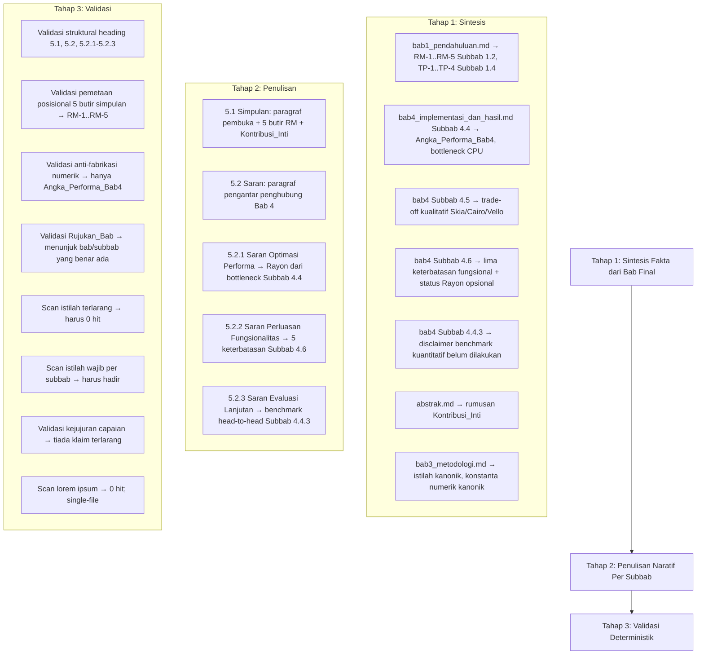
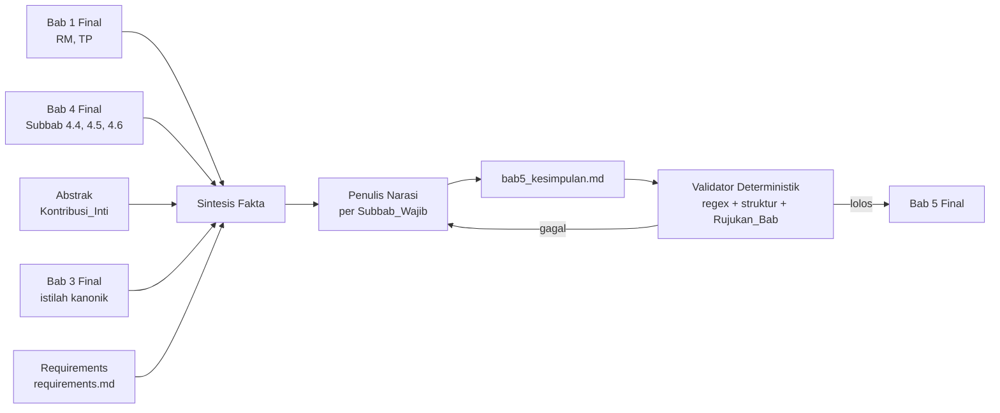

# Design Document: Penulisan Bab 5 Simpulan dan Saran

## Overview

Dokumen desain ini mendeskripsikan pendekatan sistematis untuk menulis berkas `Skripsi/bab5_kesimpulan.md` (Bab 5: Simpulan dan Saran) dari nol, menggantikan teks placeholder (*lorem ipsum*) yang saat ini menempati seluruh berkas pada dua subbab dummy. Output akhir adalah satu berkas Markdown tunggal berisi narasi akademik berbahasa Indonesia formal yang menyimpulkan penelitian Arabella dan mengusulkan pengembangan lanjutan.

Pendekatan penulisan mewarisi prinsip dari dua spec pendahulunya — `revisi-bab3-metodologi` dan `penulisan-bab4-implementasi-dan-hasil` — yaitu bahwa source code Arabella (`src/`, `examples/`, `tests/`, `assets/`, `Cargo.toml`, `Cargo.lock`, `.cargo/config.toml`) bersifat *read-only* dan tidak boleh dimodifikasi. Namun Bab 5 berbeda secara mendasar dari Bab 3 dan Bab 4 dalam hal **sumber kebenaran (source of truth) dan model ketertelusurannya**.

Bab 3 dan Bab 4 adalah bab teknis: setiap klaimnya ditelusuri langsung ke source code melalui rujukan berformat `` `berkas:simbol` ``. Sebaliknya, **Bab 5 adalah bab sintesis, bukan bab teknis baru**. Bab 5 tidak memperkenalkan klaim teknis, struktur data, algoritma, angka performa, atau terminologi baru. Seluruh substansi faktual Bab 5 diturunkan dari tiga sumber yang sudah selesai ditulis: (a) Rumusan_Masalah (Subbab 1.2) dan Tujuan_Penelitian (Subbab 1.4) pada Bab_1_Final; (b) hasil implementasi, pengukuran performa nyata, pembahasan *trade-off*, dan keterbatasan pada Bab_4_Final (Subbab 4.4, 4.5, 4.6); serta (c) Abstrak. Oleh karena itu, **ketertelusuran Bab 5 mengarah ke bab-bab tersebut melalui Rujukan_Bab** (`Bab 1`, `Subbab 1.2`, `Subbab 4.4`, `Subbab 4.6`), bukan ke rujukan kode.

Konsekuensi terpenting dari sifat sintesis ini adalah dua kelas constraint yang dominan dalam desain ini: pertama, **larangan fabrikasi numerik yang ketat** — Bab 5 tidak boleh memunculkan satu pun angka performa yang tidak hadir secara literal pada Bab 4, dan setiap angka yang dikutip harus identik dengan nilai pada Angka_Performa_Bab4 beserta penyajian numeriknya (koma sebagai pemisah desimal); kedua, **kejujuran capaian** — Bab 5 tidak boleh mengklaim capaian yang tidak dilaporkan tercapai pada Bab 4 (paralelisme *Rayon* belum aktif, *benchmark* kuantitatif langsung belum dilakukan, tidak ada keunggulan performa kuantitatif terhadap Skia, Cairo, atau Vello).

### Keputusan Desain Utama

1. **Sintesis, bukan penulisan teknis baru** — Setiap Klaim_Sintesis pada Bab 5 diturunkan dari Bab_1_Final, Bab_4_Final, atau Abstrak. Tidak ada fakta teknis, nilai numerik, atau terminologi baru yang diperkenalkan. Penyebutan tahap *pipeline* bersifat rujukan ringkas untuk keperluan sintesis, bukan uraian teknis ulang.
2. **Ketertelusuran melalui Rujukan_Bab, bukan rujukan kode** — Setiap Klaim_Sintesis yang menyimpulkan hasil atau menyitir temuan empiris menyertakan minimal satu Rujukan_Bab (`Bab N` atau `Subbab N.M[.K]`) pada blok yang sama. Rujukan kode berformat `` `berkas:simbol` `` tidak dipakai sebagai dasar ketertelusuran.
3. **Pemetaan posisional Simpulan ↔ Rumusan_Masalah** — Subbab 5.1 memuat tepat lima butir simpulan, di mana butir ke-*n* menjawab RM-*n* secara satu-ke-satu dan menaik monotonik dari RM-1 sampai RM-5, sekaligus secara kolektif mencerminkan Tujuan_Penelitian TP-1 sampai TP-4.
4. **Pemetaan Saran ↔ temuan Bab 4** — Subbab 5.2.1 diturunkan dari temuan *bottleneck* pra-pemrosesan CPU pada Subbab 4.4; Subbab 5.2.2 dipetakan satu-ke-satu ke kelima keterbatasan fungsional pada Subbab 4.6; Subbab 5.2.3 menutup keterbatasan metodologis (ketiadaan *benchmark* kuantitatif) pada Subbab 4.4.3.
5. **Anti-fabrikasi numerik** — Tiap nilai numerik performa wajib identik dengan Angka_Performa_Bab4 dan disertai Rujukan_Bab; tidak ada nilai estimasi, proyeksi, target, atau angka karangan. Subbab 5.2.1 secara khusus dilarang menjanjikan angka peningkatan performa spesifik.
6. **Kejujuran capaian** — Tidak ada klaim bahwa paralelisme *Rayon* telah aktif, bahwa *benchmark* kuantitatif langsung telah dilakukan, atau bahwa Arabella unggul secara performa kuantitatif terhadap renderer pembanding.
7. **Kontinuitas terminologi kanonik dan eliminasi Istilah_Terlarang** — Istilah kanonik (`pipeline hibrida`, `non-compute`, `pra-pemrosesan`, `binning DDA`, `akumulator signed-area`, `propagasi backdrop`, `fragment shader`, `winding number`) dipakai persis seperti Bab 1–4, sedangkan Istilah_Terlarang yang diteruskan dari Spec_Bab3 dan Spec_Bab4 tetap dilarang.
8. **Single-file output dan eliminasi lorem ipsum** — Seluruh konten ditempatkan pada satu berkas `Skripsi/bab5_kesimpulan.md`; seluruh teks *lorem ipsum* dihapus; tidak ada berkas Bab 5 tambahan, salinan, atau draf alternatif yang dibuat.
9. **Gaya bahasa akademik formal** — Bahasa Indonesia formal, kalimat lengkap berpola subjek-predikat, tanpa kata ganti orang pertama/kedua, tanpa ragam percakapan, dengan format `backtick`/italic yang konsisten seperti Bab 1–4.

## Architecture

Arsitektur proses penulisan Bab 5 terdiri atas pipeline tiga tahap yang dieksekusi secara sekuensial. Tahap 1 menyintesis fakta dari bab-bab yang sudah final (Bab 1, Bab 4, Abstrak) dan mengumpulkan terminologi kanonik dari Bab 3. Tahap 2 menulis konten naratif per Subbab_Wajib berdasarkan fakta sintesis tersebut, dengan menyisipkan Rujukan_Bab pada setiap Klaim_Sintesis. Tahap 3 memvalidasi output melalui pencarian teks deterministik untuk memastikan kelengkapan heading, pemetaan posisional simpulan, kehadiran istilah wajib, ketiadaan istilah terlarang, validitas Rujukan_Bab, dan kepatuhan anti-fabrikasi numerik.



### Aliran Data



### Strategi Sintesis Antar-Bab

Berbeda dengan Bab 4 yang setiap subbabnya memetakan satu berkas source code, setiap Subbab_Wajib Bab 5 memetakan satu atau lebih subbab pada bab final sebagai sumber substansinya. Tabel berikut memetakan setiap Subbab_Wajib ke sumber sintesisnya dan Rujukan_Bab wajib yang menyertainya.

| Subbab_Wajib Bab 5 | Sumber Sintesis | Rujukan_Bab Wajib |
|---|---|---|
| 5.1 Simpulan (paragraf pembuka) | Subbab 1.2 (Rumusan_Masalah), Subbab 1.4 (Tujuan_Penelitian) | `Bab 1`, `Subbab 1.2`, `Subbab 1.4` |
| 5.1 butir RM-1 | Subbab 4.1, 4.2 (arsitektur pipeline hibrida CPU/GPU) | `Bab 4` atau `Subbab 4.1` atau `Subbab 4.2` |
| 5.1 butir RM-2 | Subbab 4.6 (SIMD aktif, Rayon belum aktif) | `Subbab 4.6` (+ tautan ke `Subbab 5.2.1`) |
| 5.1 butir RM-3 | Subbab 4.4 (GPU stabil, CPU mendominasi) | `Subbab 4.4` |
| 5.1 butir RM-4 | Subbab 4.4 (bottleneck CPU single-thread, Angka_Performa_Bab4) | `Subbab 4.4` |
| 5.1 butir RM-5 | Subbab 4.4.3, 4.5 (perbandingan kualitatif) | `Subbab 4.4` atau `Subbab 4.4.3`, `Subbab 4.5` |
| 5.1 Kontribusi_Inti | Abstrak (kelayakan pipeline non-compute pada WebGL 2.0) | — (penegasan, bukan klaim empiris baru) |
| 5.2 Saran (pengantar) | Subbab 4.4, 4.6 (keterbatasan dan temuan) | `Bab 4`, `Subbab 4.4` atau `Subbab 4.6` |
| 5.2.1 Saran Optimasi Performa | Subbab 4.4 (bottleneck), Subbab 4.6 (feature `multithreading` opsional) | `Subbab 4.4`, `Subbab 4.6` |
| 5.2.2 Saran Perluasan Fungsionalitas | Subbab 4.6 (lima keterbatasan fungsional) | `Subbab 4.6` |
| 5.2.3 Saran Evaluasi Lanjutan | Subbab 4.4.3 (disclaimer benchmark) | `Subbab 4.4.3` atau `Subbab 4.4` |

## Components and Interfaces

### Komponen 1: Sintesizer Fakta Antar-Bab

**Tanggung jawab.** Membaca berkas bab yang sudah final (`Skripsi/bab1_pendahuluan.md`, `Skripsi/bab4_implementasi_dan_hasil.md`, `Skripsi/abstrak.md`) dan terminologi kanonik (`Skripsi/bab3_metodologi.md`) secara *strict read-only*, lalu mengekstrak fakta sintesis terstruktur yang akan menjadi basis kalimat per Subbab_Wajib. Komponen ini tidak membaca source code untuk menarik klaim teknis baru; pembacaan source code hanya diperlukan jika sebuah nama identifier perlu dikutip untuk menjaga konsistensi terminologi.

**Input.** `Skripsi/bab1_pendahuluan.md` (Subbab 1.2, 1.4), `Skripsi/bab4_implementasi_dan_hasil.md` (Subbab 4.1, 4.2, 4.4, 4.4.3, 4.5, 4.6), `Skripsi/abstrak.md`, `Skripsi/bab3_metodologi.md` (istilah kanonik dan konstanta numerik kanonik), dan `requirements.md`.

**Output.** Daftar Fakta_Sintesis terstruktur per Subbab_Wajib (lihat Data Model 1).

**Pemetaan sumber → fakta sintesis.**

| Sumber | Fakta yang Disintesis | Subbab Target |
|---|---|---|
| `bab1_pendahuluan.md` Subbab 1.2 | RM-1..RM-5 (lima pertanyaan penelitian) | 5.1 (pembuka + lima butir) |
| `bab1_pendahuluan.md` Subbab 1.4 | TP-1..TP-4 (empat tujuan penelitian) | 5.1 (butir kolektif) |
| `bab4...md` Subbab 4.1, 4.2 | pembagian beban CPU (flattening, binning DDA, akumulator signed-area, propagasi backdrop) dan GPU (vertex shader, fragment shader) | 5.1 butir RM-1 |
| `bab4...md` Subbab 4.6 | SIMD aktif; `Rayon`/`multithreading` opsional belum aktif; lima keterbatasan fungsional | 5.1 butir RM-2; 5.2.1; 5.2.2 |
| `bab4...md` Subbab 4.4 | biaya GPU landai & stabil; CPU pra-pemrosesan mendominasi; bottleneck single-thread; Angka_Performa_Bab4 | 5.1 butir RM-3, RM-4; 5.2.1 |
| `bab4...md` Subbab 4.4.3 | perbandingan kualitatif; *benchmark* kuantitatif belum dilakukan; ketergantungan pada konfigurasi mesin uji | 5.1 butir RM-5; 5.2.3 |
| `bab4...md` Subbab 4.5 | *trade-off* kompatibilitas, kompleksitas, performa terhadap Skia, Cairo, Vello | 5.1 butir RM-5 |
| `abstrak.md` | rumusan Kontribusi_Inti (kelayakan pipeline hibrida non-compute pada WebGL 2.0 melalui Arabella) | 5.1 Kontribusi_Inti |
| `bab3_metodologi.md` | istilah kanonik; konstanta numerik kanonik (16×8, `Tile` 44 byte, 1080×520, `F24Dot8`, 8.8 *fixed-point*, `WINDING_UNIT = 256`) | seluruh subbab |

### Komponen 2: Penulis Narasi Per Subbab

**Tanggung jawab.** Menulis konten Markdown setiap Subbab_Wajib Bab 5 berdasarkan Fakta_Sintesis dari Komponen 1, dengan memperhatikan: (a) penyertaan Rujukan_Bab pada setiap Klaim_Sintesis; (b) pemetaan posisional simpulan ke RM; (c) anti-fabrikasi numerik; (d) kejujuran capaian; (e) kontinuitas terminologi kanonik dan eliminasi istilah terlarang; (f) gaya bahasa akademik formal.

**Strategi penulisan per subbab.**

| Subbab | Strategi Naratif |
|---|---|
| `# BAB 5 SIMPULAN DAN SARAN` | Tulis heading utama level 1 pada baris pertama berkas, kapitalisasi penuh, prefiks `# ` (satu pagar + satu spasi), tanpa BOM, tanpa whitespace tepi. |
| `## 5.1 Simpulan` | Tulis paragraf pembuka yang menyatakan simpulan disusun untuk menjawab Rumusan_Masalah (`Subbab 1.2`) dan Tujuan_Penelitian (`Subbab 1.4`), memuat token literal `Bab 1`, `Subbab 1.2`, dan `Subbab 1.4`. Lanjutkan dengan tepat lima butir simpulan (ordered list lima item atau lima paragraf berurutan) yang memetakan RM-1..RM-5 secara posisional. Tutup dengan penegasan Kontribusi_Inti. Subbab 5.1 tidak memuat heading bersarang. |
| 5.1 butir RM-1 | Nyatakan arsitektur *pipeline hibrida* *non-compute* berhasil dirancang dan diwujudkan dengan pembagian beban CPU (*flattening*, *binning DDA*, *akumulator signed-area*, *propagasi backdrop*) dan GPU (rasterisasi melalui *vertex shader* dan *fragment shader*), disertai Rujukan_Bab ke `Bab 4` (atau `Subbab 4.1`/`Subbab 4.2`). |
| 5.1 butir RM-2 | Nyatakan secara jujur bahwa fondasi struktur data berbasis ubin untuk paralelisasi pra-pemrosesan CPU telah terwujud dan paralelisme tingkat instruksi melalui SIMD telah aktif, sementara paralelisme tingkat data penuh melalui *Rayon* *multithreading* belum diaktifkan; sertakan Rujukan_Bab ke `Subbab 4.6` dan tautan ke saran pada `Subbab 5.2.1`. |
| 5.1 butir RM-3 | Nyatakan pembagian beban CPU/GPU efektif untuk adegan kecil sampai menengah; biaya rasterisasi GPU tumbuh landai dan stabil sementara biaya pra-pemrosesan CPU mendominasi total waktu satu *frame*; sertakan Rujukan_Bab ke `Subbab 4.4`. |
| 5.1 butir RM-4 | Nyatakan pada adegan berskala sangat besar tahap pra-pemrosesan CPU *single-thread* menjadi *bottleneck* dominan; jika menyertakan nilai numerik, gunakan Angka_Performa_Bab4 secara identik (150,15 ms dari 156,15 ms total, sekitar 96 persen, dan 6,4 FPS pada `paris-30k.svg`) disertai Rujukan_Bab ke `Subbab 4.4`. |
| 5.1 butir RM-5 | Nyatakan secara jujur bahwa perbandingan terhadap renderer berbasis *compute shader* (Vello) dan renderer CPU murni (Skia, Cairo) bersifat kualitatif pada dimensi kompatibilitas, kompleksitas implementasi, dan performa arsitektural, dan bahwa *benchmark* kuantitatif langsung belum dilakukan; sertakan Rujukan_Bab ke `Subbab 4.4` (atau `Subbab 4.4.3`) dan `Subbab 4.5`. |
| 5.1 Kontribusi_Inti | Tegaskan kelayakan *pipeline* rendering vektor hibrida *non-compute* pada lingkungan WebGL 2.0 telah terbukti melalui purwarupa Arabella; muat frasa literal `pipeline`, `non-compute`, `WebGL 2.0`, dan `Arabella`. Tempatkan di Subbab 5.1, bukan 5.2. Jangan klaim keunggulan performa kuantitatif. |
| `## 5.2 Saran` | Tulis paragraf pengantar yang menyatakan saran pengembangan lanjutan diturunkan dari keterbatasan dan temuan pada Bab 4, memuat minimal satu Rujukan_Bab ke `Subbab 4.4` atau `Subbab 4.6`. |
| `### 5.2.1 Saran Optimasi Performa` | Usulkan pengaktifan paralelisme tingkat data melalui *Rayon* *multithreading* pada pra-pemrosesan CPU (*flattening* dan *binning DDA* per jalur), muat token `Rayon` dan `multithreading`; tautkan ke *bottleneck* pra-pemrosesan CPU *single-thread* (`Subbab 4.4`); nyatakan beban pra-pemrosesan tiap jalur saling independen sehingga dapat-diparalelkan (`Subbab 4.6`); nyatakan usulan ini potensi optimasi yang masih perlu diverifikasi. Jangan menjanjikan angka *speedup*, FPS target, persentase pengurangan, atau waktu target dalam `ms`. |
| `### 5.2.2 Saran Perluasan Fungsionalitas` | Usulkan minimal lima perluasan yang dipetakan satu-ke-satu ke kelima keterbatasan fungsional Subbab 4.6: (1) paint bergradien pada *fragment shader*; (2) *image paint* dan *tinting*; (3) perluasan subset SVG di luar `g`/`path`; (4) sistem *text rendering*; (5) *filter effect* (*blur*/*drop shadow*). Susun sebagai daftar atau paragraf yang dapat diidentifikasi terpisah; muat Rujukan_Bab ke `Subbab 4.6`; gunakan istilah kanonik `fragment shader`; jangan perkenalkan nama identifier baru; nyatakan seluruhnya sebagai *future work* yang belum terimplementasi. |
| `### 5.2.3 Saran Evaluasi Lanjutan` | Usulkan *benchmark* kuantitatif langsung (*head-to-head*) yang membandingkan Arabella terhadap Skia, Cairo, dan Vello (sebut ketiganya secara literal); tautkan ke disclaimer `Subbab 4.4.3`; nyatakan benchmark harus dijalankan pada perangkat keras dan berkas uji yang identik antar-renderer; jangan menyatakan prakiraan hasil. |

### Komponen 3: Validator Deterministik Pasca-Tulis

**Tanggung jawab.** Memverifikasi bahwa berkas output `Skripsi/bab5_kesimpulan.md` memenuhi seluruh constraint requirements melalui pencarian teks deterministik dan pemeriksaan struktural. Validator hanya membaca berkas Markdown output, berkas bab final sebagai pembanding verbatim, dan struktur repositori; ia tidak mengeksekusi kode aplikasi.

**Prosedur validasi.**

1. **Validasi Struktural Heading (Req 1, 3):** Verifikasi baris pertama berkas adalah literal `# BAB 5 SIMPULAN DAN SARAN`; verifikasi kehadiran tepat satu kali untuk `## 5.1 Simpulan`, `## 5.2 Saran`, `### 5.2.1 Saran Optimasi Performa`, `### 5.2.2 Saran Perluasan Fungsionalitas`, dan `### 5.2.3 Saran Evaluasi Lanjutan`; verifikasi urutan menaik monotonik 5.1 → 5.2 dan 5.2.1 → 5.2.2 → 5.2.3; verifikasi tiada heading level 2/3 lain di luar Subbab_Wajib; verifikasi tiada heading bersarang di bawah 5.1; abaikan kemunculan teks heading di dalam *fenced code block*.
2. **Validasi Eliminasi Lorem Ipsum (Req 1):** Pencarian *case-insensitive* untuk `lorem ipsum`, `dolor sit amet`, `consectetur adipiscing`, `tempor incididunt`, `exercitation ullamco`, `duis aute irure`. Kondisi PASS = 0 *hit*.
3. **Validasi Single-File Output (Req 1):** Pencarian rekursif berkas yang baris pertamanya `# BAB 5 SIMPULAN DAN SARAN` atau yang namanya mengandung `bab5` (*case-insensitive*), dengan mengabaikan seluruh berkas di dalam `.kiro/specs/`. Kondisi PASS = hanya `Skripsi/bab5_kesimpulan.md` yang memenuhi.
4. **Validasi Pemetaan Posisional Simpulan (Req 4):** Verifikasi Subbab 5.1 memuat tepat lima butir; verifikasi butir ke-*n* membahas pokok RM-*n*; verifikasi kelima butir secara kolektif mencerminkan TP-1..TP-4.
5. **Validasi Anti-Fabrikasi Numerik (Req 6, 10):** Pencarian regex pola numerik berunit performa pada seluruh berkas; setiap kemunculan harus identik dengan Angka_Performa_Bab4 (penyajian koma desimal dan satuan) dan disertai Rujukan_Bab ke `Subbab 4.4` pada blok yang sama; konstanta numerik kanonik (16×8, `Tile` 44 byte, 1080×520, `F24Dot8`, 8.8 *fixed-point*, `WINDING_UNIT = 256`) harus identik dengan Bab_3_Final/Bab_4_Final bila disebut.
6. **Validasi Rujukan_Bab (Req 9):** Untuk setiap token `Bab N` atau `Subbab N.M[.K]`, verifikasi bahwa bab/subbab yang dirujuk benar-benar ada (Bab 1–5; Bab 1: 1.1–1.6; Bab 4: 4.1–4.6, 4.2.1–4.2.8, 4.4.1–4.4.3); verifikasi tiada rujukan kode `` `berkas:simbol` `` yang dijadikan dasar Klaim_Sintesis.
7. **Validasi Kehadiran Istilah Wajib (Req 4, 5, 6, 7, 8, 11, 12):** Pencarian per Subbab untuk setiap istilah wajib pada Data Model 6. Kondisi PASS = minimal satu kemunculan per istilah pada subbab yang tepat.
8. **Validasi Eliminasi Istilah Terlarang (Req 11):** Pencarian regex untuk setiap istilah pada Data Model 7. Kondisi PASS = 0 kemunculan dalam konteks yang dilarang.
9. **Validasi Kejujuran Capaian (Req 4, 5, 6, 8):** Verifikasi tiada pernyataan bahwa *Rayon* telah aktif, bahwa *benchmark* kuantitatif langsung telah dilakukan, bahwa Arabella unggul kuantitatif terhadap Skia/Cairo/Vello, atau prakiraan hasil *benchmark*; verifikasi Subbab 5.2.1 tidak menjanjikan angka peningkatan performa spesifik.
10. **Validasi Konektivitas Naratif dan Anti-Duplikasi (Req 12):** Verifikasi Subbab 5.1 memuat token `Bab 4`; verifikasi Subbab 5.2 memuat Rujukan_Bab ke `Subbab 4.4`/`Subbab 4.6`; verifikasi tiada blok verbatim > 30 kata berurutan yang identik dengan Bab_1_Final, Bab_3_Final, atau Bab_4_Final; verifikasi kemunculan `future work` atau `pengembangan lanjutan`.
11. **Validasi Gaya Bahasa (Req 13):** Pencarian *word-boundary case-insensitive* untuk token percakapan (`bisa`, `gak`, `enggak`, `nih`, `dong`, `kok`, `kan`, `aja`, `udah`, `mau`) dan kata ganti orang pertama/kedua (`saya`, `kami`, `kita`, `Anda`, `kamu`) di luar *fenced code block*. Kondisi PASS = 0 *hit*; verifikasi format `backtick`/italic konsisten dan penomoran subbab `5.x`/`5.x.y`.

## Data Models

### Model 1: Fakta Sintesis (Intermediate Representation)

Setiap fakta yang disintesis dari bab final direpresentasikan sebagai tuple konseptual:

```
FaktaSintesis {
    subbab_target: String,       // misalnya "5.1", "5.2.1", "5.2.2", "5.2.3"
    kategori: enum {Simpulan, Kontribusi, SaranOptimasi, SaranFungsional, SaranEvaluasi},
    klaim_sintesis: String,      // kalimat yang akan ditulis di Bab 5
    rujukan_bab: [String],       // misalnya ["Subbab 4.4"], ["Subbab 4.6", "Subbab 5.2.1"]
    sumber_bab: String,          // bab/subbab final yang membuktikan substansi klaim
    nilai_numerik: Option<String>, // jika ada, harus anggota Angka_Performa_Bab4
}
```

Aturan invarian Model 1: jika `nilai_numerik` tidak kosong, nilainya wajib anggota Angka_Performa_Bab4 (Model 4) dan `rujukan_bab` wajib memuat `Subbab 4.4`; `klaim_sintesis` tidak boleh memperkenalkan fakta teknis atau terminologi yang tidak hadir pada `sumber_bab`.

### Model 2: Struktur Heading Bab 5

Struktur heading yang harus dihasilkan oleh Komponen 2 dan diverifikasi oleh Komponen 3:

```
HeadingTree {
    level_1: "# BAB 5 SIMPULAN DAN SARAN"   // baris pertama berkas
    children: [
        {level_2: "## 5.1 Simpulan"},        // tanpa heading bersarang
        {level_2: "## 5.2 Saran", children: [
            {level_3: "### 5.2.1 Saran Optimasi Performa"},
            {level_3: "### 5.2.2 Saran Perluasan Fungsionalitas"},
            {level_3: "### 5.2.3 Saran Evaluasi Lanjutan"},
        ]},
    ]
}
```

Invarian struktural: heading level 2 menaik monotonik 5.1 → 5.2 tanpa lompatan/pengulangan/pembalikan; ketiga subheading 5.2.y menaik monotonik kontigu 1 → 2 → 3 dan diletakkan setelah induknya `## 5.2 Saran`; tidak ada heading level 2/3 lain di luar himpunan ini; Subbab 5.1 tidak memuat heading level 3 atau lebih dalam.

### Model 3: Pemetaan Posisional Simpulan ↔ Rumusan_Masalah ↔ Tujuan_Penelitian

Tabel ini menetapkan pemetaan satu-ke-satu posisional kelima butir simpulan pada Subbab 5.1 terhadap Rumusan_Masalah, beserta cakupan kolektif terhadap Tujuan_Penelitian.

| Butir Simpulan | Menjawab | Substansi Inti (dari Bab 4) | Rujukan_Bab | TP Tercermin |
|---|---|---|---|---|
| 1 | RM-1 | arsitektur *pipeline hibrida non-compute* terwujud; pembagian CPU/GPU | `Bab 4`/`Subbab 4.1`/`Subbab 4.2` | TP-1 |
| 2 | RM-2 | fondasi struktur data berbasis ubin + SIMD aktif; *Rayon* belum aktif | `Subbab 4.6` (+ `Subbab 5.2.1`) | TP-2 |
| 3 | RM-3 | pembagian beban efektif skala kecil–menengah; GPU stabil, CPU dominan | `Subbab 4.4` | TP-3 |
| 4 | RM-4 | *bottleneck* pra-pemrosesan CPU *single-thread* pada skala besar | `Subbab 4.4` | TP-3 |
| 5 | RM-5 | perbandingan kualitatif Skia/Cairo/Vello; *benchmark* belum dilakukan | `Subbab 4.4`/`Subbab 4.4.3`, `Subbab 4.5` | TP-4 |

Invarian Model 3: pemetaan butir ke RM bersifat satu-ke-satu, menaik monotonik dari RM-1 sampai RM-5; gabungan kelima butir wajib mencerminkan TP-1 sampai TP-4 sehingga setiap TP tercermin pada minimal satu butir.

### Model 4: Angka_Performa_Bab4 (Himpunan Numerik Kanonik)

Satu-satunya nilai numerik performa yang boleh dikutip pada Bab 5. Setiap kemunculan wajib identik secara byte, termasuk tanda koma sebagai pemisah desimal dan satuan.

| Aset | CPU ms | GPU ms | Total Frame Time ms | FPS |
|---|---|---|---|---|
| `el_gato.svg` | 0,69 | 0,100 | 0,79 | 1266 |
| `Ghostscript_Tiger.svg` | 9,37 | 0,321 | 9,69 | 103 |
| `paris-30k.svg` | 150,15 | 6,00 | 156,15 | 6,4 |

Temuan *bottleneck* kanonik: pada `paris-30k.svg`, pra-pemrosesan CPU *single-thread* menyumbang **150,15 ms dari 156,15 ms total (sekitar 96 persen)** waktu satu *frame*. Sumber: Tabel 4.4 dan narasi Subbab 4.4 pada Bab_4_Final.

Konstanta numerik kanonik (boleh disebut bila diperlukan, wajib identik dengan Bab_3_Final/Bab_4_Final): dimensi ubin `16×8`, ukuran rekord `Tile` `44 byte`, resolusi pengujian `1080×520`, format segmen `F24Dot8`, format akumulator winding `8.8 fixed-point`, `WINDING_UNIT = 256`.

### Model 5: Pemetaan Saran ↔ Keterbatasan Bab 4

Tabel ini menetapkan pemetaan setiap subbab saran terhadap temuan/keterbatasan Bab 4 yang ditutupnya.

| Subbab Saran | Sumber di Bab 4 | Substansi Usulan |
|---|---|---|
| 5.2.1 Saran Optimasi Performa | Subbab 4.4 (*bottleneck* CPU *single-thread*); Subbab 4.6 (feature `multithreading` opsional) | Aktifkan paralelisme tingkat data via *Rayon* *multithreading* pada *flattening* dan *binning DDA* per jalur yang saling independen |
| 5.2.2 keterbatasan (1) | Subbab 4.6 — gradien belum aktif | Paint bergradien (linear, radial, sweep) pada *fragment shader* |
| 5.2.2 keterbatasan (2) | Subbab 4.6 — *image paint* belum diunggah | Dukungan *image paint* dan *tinting* |
| 5.2.2 keterbatasan (3) | Subbab 4.6 — subset SVG terbatas `g`/`path` | Perluasan subset SVG (`defs`, `use`, bentuk dasar, gradien, *pattern*) |
| 5.2.2 keterbatasan (4) | Subbab 4.6 — tiada *text rendering* | Penambahan sistem *text rendering* |
| 5.2.2 keterbatasan (5) | Subbab 4.6 — tiada *filter effect* | Penambahan *filter effect* (*blur*, *drop shadow*) |
| 5.2.3 Saran Evaluasi Lanjutan | Subbab 4.4.3 (*benchmark* kuantitatif belum dilakukan) | *Benchmark* *head-to-head* Arabella vs Skia, Cairo, Vello pada perangkat keras dan berkas uji identik |

Invarian Model 5: Subbab 5.2.2 wajib memuat minimal lima usulan yang dapat diidentifikasi terpisah (satu item daftar atau satu blok teks per usulan), mencakup kelima dimensi keterbatasan; setiap usulan dinyatakan sebagai *future work* yang belum terimplementasi.

### Model 6: Istilah Wajib per Subbab

Daftar istilah/token yang wajib muncul minimal satu kali pada subbab yang ditentukan. Diturunkan langsung dari acceptance criteria (Req 4–8, 11, 12) dan dipakai Komponen 3 untuk validasi kehadiran.

| Subbab | Istilah/Token Wajib |
|---|---|
| 5.1 (pembuka) | `Bab 1`, `Subbab 1.2`, `Subbab 1.4` |
| 5.1 butir RM-1 | `pipeline hibrida`, `non-compute`, `CPU`, `GPU`, `fragment shader`, Rujukan ke `Bab 4`/`Subbab 4.1`/`Subbab 4.2` |
| 5.1 butir RM-2 | `SIMD`, `Rayon`, `multithreading`, `Subbab 4.6`, `Subbab 5.2.1` |
| 5.1 butir RM-3 | `pra-pemrosesan`, `Subbab 4.4` |
| 5.1 butir RM-4 | `bottleneck`, `single-thread`, `150,15`, `156,15`, `96 persen`, `6,4`, `Subbab 4.4` |
| 5.1 butir RM-5 | `Skia`, `Cairo`, `Vello`, `Subbab 4.4`/`Subbab 4.4.3`, `Subbab 4.5` |
| 5.1 Kontribusi_Inti | `pipeline`, `non-compute`, `WebGL 2.0`, `Arabella` |
| 5.1 (konektivitas) | `Bab 4` |
| 5.2 (pengantar) | `Subbab 4.4` atau `Subbab 4.6`, `pengembangan lanjutan` atau `future work` |
| 5.2.1 | `Rayon`, `multithreading`, `Subbab 4.4`, `Subbab 4.6` |
| 5.2.2 | `fragment shader`, `image paint`, `text rendering`, `filter effect`, subset SVG, `Subbab 4.6` |
| 5.2.3 | `Skia`, `Cairo`, `Vello`, `Subbab 4.4.3` atau `Subbab 4.4` |
| Global (≥1 kali di seluruh dokumen) | `pipeline hibrida`, `non-compute` (atau `tanpa compute shader`), `WebGL 2.0`, `Arabella`, `pra-pemrosesan`, `CPU`, `GPU`, `winding number` |

### Model 7: Istilah Terlarang (Diteruskan dari Spec_Bab3 dan Spec_Bab4)

Istilah berikut tidak boleh muncul pada Bab 5. Daftar diteruskan dari `revisi-bab3-metodologi` dan `penulisan-bab4-implementasi-dan-hasil` agar referensi silang antar bab tetap koheren.

| Istilah Terlarang | Aturan Pencocokan | Pengganti Kanonik di Bab 5 |
|---|---|---|
| `Ray Shooting`, `Ray Shoot`, `ray shooting`, `ray shoot` | frasa utuh, *case-insensitive* | `binning DDA` + `akumulator signed-area` |
| `TileType` | token kata utuh, *case-sensitive* | (tidak ada enum tipe ubin pada source code) |
| `EMPTY`, `INTERIOR`, `EDGE` | token kata utuh, *case-sensitive*, sebagai label tipe ubin/cabang shader | `ubin nontrivial` vs `ubin trivial` |
| `winding_number` | token kata utuh *case-sensitive* dengan underscore | `winding number` (konsep) / `akumulator signed-area` |
| `fungsi implisit linear`, `fungsi implisit kuadratik kanonik`, `fungsi implisit kubik` | frasa utuh, *case-insensitive* | `flattening` ke segmen garis + `line_box` |
| `PPGA`, `Projective Geometric Algebra` | `PPGA` *case-sensitive*; frasa *case-insensitive* | (tidak dipakai) |
| `OpenGL ES 3.0 yang ditranspilasikan`, `ditranspilasikan ke WebGL`, `transpilasi OpenGL ES` | frasa, *case-insensitive* | `WebGL 2.0` sebagai target langsung |
| `Rust edisi 2021`, `edisi 2021`, `edition = "2021"` | frasa *case-insensitive*; literal `edition = "2021"` *case-sensitive* | `Rust edisi 2024` |
| `lorem ipsum`, `dolor sit amet`, `consectetur adipiscing`, `tempor incididunt`, `exercitation ullamco`, `duis aute irure` | frasa, *case-insensitive* | (dihapus seluruhnya, diganti narasi sintesis) |

### Model 8: Istilah Kanonik untuk Konsistensi Lintas-Bab

Tabel berikut menetapkan satu-satunya bentuk istilah yang dipakai untuk komponen/konsep tertentu, selaras dengan Subbab 3.5 pada `bab3_metodologi.md` dan Data Model 5 pada `penulisan-bab4-implementasi-dan-hasil/design.md`.

| Konsep | Istilah Kanonik Tunggal |
|---|---|
| Arsitektur Arabella keseluruhan | `pipeline hibrida` |
| Sifat pendekatan | `non-compute` (atau `tanpa compute shader`) |
| Fase CPU keseluruhan | `pra-pemrosesan` (tidak dicampur dengan `preprocessing` dalam satu paragraf) |
| Pemecahan segmen lintas ubin | `binning DDA` |
| Akumulator winding 8.8 *fixed-point* per *scanline* | `akumulator signed-area` |
| Akumulasi kiri-ke-kanan saat emisi tile | `propagasi backdrop` |
| Shader piksel WebGL | `fragment shader` |
| Konsep akumulasi winding | `winding number` (bukan field skalar `winding_number`) |
| Lingkungan target | `WebGL 2.0` |

### Model 9: Himpunan Rujukan_Bab Valid

Daftar bab/subbab yang benar-benar ada pada skripsi, dipakai Komponen 3 untuk memvalidasi setiap Rujukan_Bab.

| Tingkat | Nilai Valid |
|---|---|
| Bab | `Bab 1`, `Bab 2`, `Bab 3`, `Bab 4`, `Bab 5` |
| Subbab Bab 1 | `Subbab 1.1` – `Subbab 1.6` |
| Subbab Bab 4 | `Subbab 4.1` – `Subbab 4.6`; subheading `Subbab 4.2.1` – `Subbab 4.2.8`, `Subbab 4.4.1` – `Subbab 4.4.3` |
| Subbab Bab 5 (rujukan-diri) | `Subbab 5.1`, `Subbab 5.2`, `Subbab 5.2.1` – `Subbab 5.2.3` |

Rujukan_Bab di luar himpunan ini dinyatakan tidak valid. Rujukan kode berformat `` `berkas:simbol` `` atau `` `berkas:start-end` `` tidak boleh dijadikan dasar Klaim_Sintesis; penyebutan nama identifier kode (misalnya `fragment shader` sebagai istilah, bukan rujukan) hanya diperbolehkan untuk menjaga konsistensi terminologi.

### Model 10: Pemetaan Acceptance Criteria → Subbab → Validasi

Pemetaan terbalik setiap kelompok acceptance criteria ke subbab penanganannya dan metode validasi Komponen 3, dipakai sebagai *checklist* akhir sebelum menyatakan Bab 5 selesai.

| Req AC | Subbab Penanganan | Metode Validasi (Komponen 3) |
|---|---|---|
| 1.1–1.7 | Seluruh berkas | Validasi struktural + lorem ipsum + single-file (langkah 1, 2, 3) |
| 2.1–2.5 | (Read-only invariance) | Pemeriksaan tiada mutasi Source_Of_Truth dan bab lain |
| 3.1–3.7 | Seluruh heading | Validasi struktural heading (langkah 1) |
| 4.1–4.9 | 5.1 | Validasi pemetaan posisional + istilah wajib + kejujuran capaian (langkah 4, 7, 9) |
| 5.1–5.4 | 5.1 | Validasi Kontribusi_Inti + kejujuran capaian (langkah 7, 9) |
| 6.1–6.5 | 5.2.1 | Validasi istilah wajib + anti-fabrikasi numerik + kejujuran (langkah 5, 7, 9) |
| 7.1–7.6 | 5.2.2 | Validasi lima usulan + pemetaan keterbatasan + istilah wajib (langkah 7) |
| 8.1–8.4 | 5.2.3 | Validasi istilah wajib + kejujuran capaian (langkah 7, 9) |
| 9.1–9.5 | Seluruh Klaim_Sintesis | Validasi Rujukan_Bab (langkah 6) |
| 10.1–10.5 | 5.1, 5.2.1 | Validasi anti-fabrikasi numerik (langkah 5) |
| 11.1–11.6 | Seluruh berkas | Validasi istilah wajib + eliminasi istilah terlarang (langkah 7, 8) |
| 12.1–12.5 | 5.1, 5.2 | Validasi konektivitas naratif + anti-duplikasi (langkah 10) |
| 13.1–13.5 | Seluruh berkas | Validasi gaya bahasa + format (langkah 11) |

## Correctness Properties

*A property is a characteristic or behavior that should hold true across all valid executions of a system — essentially, a formal statement about what the system should do. Properties serve as the bridge between human-readable specifications and machine-verifiable correctness guarantees.*

Spec ini menghasilkan satu berkas Markdown akademik (bukan kode yang dapat dieksekusi), sehingga properti di bawah ini tidak diuji melalui *property-based testing* dengan iterasi acak. Sebaliknya, setiap properti diformulasikan sebagai pernyataan terkuantifikasi universal terhadap konten berkas `Skripsi/bab5_kesimpulan.md`, bab final pembanding (Bab 1, Bab 3, Bab 4, Abstrak), dan struktur repositori, lalu diverifikasi secara deterministik melalui pencarian teks (regex), pemeriksaan struktural heading, dan cross-referensi antar-bab. Setiap properti dirancang agar dapat dievaluasi sebagai predikat boolean PASS/FAIL atas satu artefak dokumen. Pendekatan ini selaras dengan strategi yang sudah dipakai pada spec `revisi-bab3-metodologi` dan `penulisan-bab4-implementasi-dan-hasil`.

### Property 1: Single-File Output Identity

*For all* jalur berkas pada repositori (di luar direktori `.kiro/specs/`) yang nama berkasnya mengandung substring `bab5` (pencocokan *case-insensitive*) atau yang baris pertamanya adalah literal `# BAB 5 SIMPULAN DAN SARAN`, satu-satunya berkas yang memenuhi adalah `Skripsi/bab5_kesimpulan.md`; dan tidak ada salinan utuh, salinan parsial, cadangan, atau draf alternatif Bab 5 di lokasi lain mana pun; dan berkas tersebut memuat heading utama beserta seluruh Subbab_Wajib.

**Validates: Requirements 1.1, 1.5, 1.6**

### Property 2: Markdown Validity and Lorem-Ipsum Absence

*For all* isi `Skripsi/bab5_kesimpulan.md`: berkas berekstensi `.md`, ber-encoding UTF-8 tanpa BOM, dan dapat diuraikan sebagai Markdown CommonMark valid tanpa galat sintaks; *and for all* substring pada berkas tersebut, tidak ada yang cocok dengan pola `lorem ipsum`, `dolor sit amet`, `consectetur adipiscing`, `tempor incididunt`, `exercitation ullamco`, atau `duis aute irure` (pencocokan *case-insensitive*).

**Validates: Requirements 1.2, 1.4, 1.7**

### Property 3: Structural Heading Invariant

*For every* heading `H` pada himpunan Subbab_Wajib (`5.1 Simpulan`, `5.2 Saran`, `5.2.1 Saran Optimasi Performa`, `5.2.2 Saran Perluasan Fungsionalitas`, `5.2.3 Saran Evaluasi Lanjutan`), `H` muncul tepat satu kali pada level Markdown ATX yang ditentukan (`##` untuk `5.X`, `###` untuk `5.X.Y`) dengan teks persis *case-sensitive*, prefiks tepat satu spasi tunggal, dan tanpa karakter tambahan; baris pertama berkas adalah literal `# BAB 5 SIMPULAN DAN SARAN`; nomor heading level 2 menaik monotonik 5.1 → 5.2 tanpa lompatan, pengulangan, atau pembalikan, dan tiada heading level 2 lain; ketiga subheading `### 5.2.Y` menaik monotonik kontigu 1 → 2 → 3, diletakkan setelah induknya `## 5.2 Saran`, dan tiada heading level 3 lain; tidak ada heading level 3 atau lebih dalam di bawah `## 5.1 Simpulan`; dan kemunculan teks heading di dalam *fenced code block* dikecualikan dari seluruh penghitungan ini.

**Validates: Requirements 1.3, 3.1, 3.2, 3.3, 3.4, 3.5, 3.6, 3.7, 13.4**

### Property 4: Positional Conclusion Mapping

*For every* indeks `n` dari 1 sampai 5, butir simpulan ke-`n` pada Subbab 5.1 menjawab Rumusan_Masalah RM-`n` secara posisional sehingga pemetaan butir-ke-RM bersifat satu-ke-satu dan menaik monotonik; Subbab 5.1 memuat tepat lima butir (sebagai *ordered list* lima item atau lima paragraf berurutan), tidak kurang dan tidak lebih; paragraf pembuka Subbab 5.1 memuat token literal `Bab 1`, `Subbab 1.2`, dan `Subbab 1.4`; butir RM-1 memuat istilah `pipeline hibrida`, `non-compute`, pembagian beban CPU dan GPU, serta Rujukan_Bab ke `Bab 4`/`Subbab 4.1`/`Subbab 4.2`; butir RM-2 memuat `SIMD`, `Rayon`, `multithreading` (sebagai sesuatu yang belum aktif), Rujukan_Bab ke `Subbab 4.6`, dan tautan ke `Subbab 5.2.1`; butir RM-3 memuat `pra-pemrosesan` dan Rujukan_Bab ke `Subbab 4.4`; butir RM-4 memuat `bottleneck`/`single-thread` dan Rujukan_Bab ke `Subbab 4.4`; butir RM-5 memuat `Skia`, `Cairo`, `Vello`, disclaimer *benchmark* belum dilakukan, serta Rujukan_Bab ke `Subbab 4.4`/`Subbab 4.4.3` dan `Subbab 4.5`; dan gabungan kelima butir mencerminkan Tujuan_Penelitian TP-1 sampai TP-4 sehingga setiap TP tercermin pada minimal satu butir.

**Validates: Requirements 4.1, 4.2, 4.3, 4.4, 4.5, 4.7, 4.8**

### Property 5: Core-Contribution Assertion

*For all* kemunculan penegasan Kontribusi_Inti, penegasan tersebut berada di dalam rentang Subbab 5.1 (bukan Subbab 5.2), memuat minimal frasa literal `pipeline`, `non-compute`, `WebGL 2.0`, dan `Arabella`, serta menyatakan kelayakan *pipeline* rendering vektor hibrida *non-compute* pada lingkungan WebGL 2.0 yang terbukti melalui purwarupa Arabella, konsisten dengan rumusan pada Abstrak.

**Validates: Requirements 5.1, 5.2, 5.3**

### Property 6: Functional-Expansion Coverage

*For every* dimensi keterbatasan fungsional pada himpunan {paint bergradien pada *fragment shader*, *image paint* dan *tinting*, perluasan subset SVG di luar `g`/`path`, sistem *text rendering*, *filter effect*}, terdapat minimal satu usulan perluasan pada Subbab 5.2.2 yang dapat diidentifikasi terpisah (tepat satu item daftar atau tepat satu blok teks) dan dipetakan satu-ke-satu ke dimensi tersebut; Subbab 5.2.2 memuat minimal satu Rujukan_Bab ke `Subbab 4.6`; istilah kanonik `fragment shader` dipakai ketika merujuk shader piksel; tiada nama identifier kode baru yang tidak hadir pada Bab_4_Final diperkenalkan; dan setiap usulan dinyatakan sebagai *future work*/pengembangan lanjutan yang belum terimplementasi.

**Validates: Requirements 7.1, 7.2, 7.3, 7.4, 7.5, 7.6**

### Property 7: Evaluation-Suggestion Completeness

*For all* konten Subbab 5.2.3, subbab tersebut mengusulkan *benchmark* kuantitatif langsung (*head-to-head*) yang menyebut `Skia`, `Cairo`, dan `Vello` secara literal, memuat Rujukan_Bab ke `Subbab 4.4.3` (atau `Subbab 4.4`), dan menyatakan syarat bahwa *benchmark* harus dijalankan pada perangkat keras dan berkas uji yang identik antar-renderer.

**Validates: Requirements 8.1, 8.2, 8.3**

### Property 8: Cross-Chapter Traceability

*For every* blok teks Markdown (satu atau lebih baris non-kosong berurutan yang dipisahkan baris kosong, atau satu item daftar) yang memuat Klaim_Sintesis yang menyimpulkan hasil penelitian atau menyitir temuan empiris, terdapat minimal satu Rujukan_Bab pada blok yang sama; *and for every* Rujukan_Bab pada Bab 5, token tersebut berformat `Bab N` atau `Subbab N.M` atau `Subbab N.M.K` dan menunjuk bab atau subbab yang benar-benar ada (himpunan valid: Bab 1–5; Subbab 1.1–1.6; Subbab 4.1–4.6, 4.2.1–4.2.8, 4.4.1–4.4.3; Subbab 5.1, 5.2, 5.2.1–5.2.3); dan tidak ada rujukan kode berformat `` `berkas:simbol` `` atau `` `berkas:start-end` `` yang dijadikan dasar Klaim_Sintesis.

**Validates: Requirements 9.1, 9.2, 9.3, 9.5, 12.2**

### Property 9: Numerical Anti-Fabrication

*For every* kemunculan nilai numerik berunit performa (`FPS`, `ms`, `persen`, *throughput*, jumlah operasi paint, jumlah ubin, persentase *bottleneck*) pada `Skripsi/bab5_kesimpulan.md`, nilai tersebut identik dengan salah satu anggota Angka_Performa_Bab4 (Data Model 4) — termasuk penyajian tanda koma sebagai pemisah desimal (misalnya `150,15`) dan satuan yang sama — dan disertai Rujukan_Bab ke `Subbab 4.4` (atau subbab Bab 4 yang melaporkannya) pada blok yang sama; *and for every* parameter numerik kanonik yang disebut (`16×8`, `Tile` `44 byte`, `1080×520`, `F24Dot8`, `8.8 fixed-point`, `WINDING_UNIT = 256`), nilainya identik dengan yang dilaporkan pada Bab_3_Final/Bab_4_Final dan disertai Rujukan_Bab; dan tidak ada nilai numerik baru, estimasi, proyeksi, target, atau nilai yang dikutip dari literatur eksternal sebagai hasil pengukuran Arabella.

**Validates: Requirements 4.6, 6.2, 9.4, 10.1, 10.2, 10.3, 10.4, 10.5**

### Property 10: Honest-Achievement Invariant

*For all* pernyataan pada `Skripsi/bab5_kesimpulan.md`, tidak ada satu pun yang menyatakan capaian yang tidak dilaporkan tercapai pada Bab_4_Final; secara khusus tidak ada pernyataan afirmatif bahwa paralelisme tingkat data penuh melalui `Rayon` *multithreading* telah aktif, bahwa *benchmark* kuantitatif langsung antar-renderer telah dilakukan, bahwa Arabella unggul secara performa kuantitatif terhadap Skia/Cairo/Vello, maupun prakiraan hasil *benchmark* (misalnya Arabella akan lebih cepat atau lebih lambat); dan Subbab 5.2.1 tidak menjanjikan angka peningkatan performa spesifik dari kategori {faktor *speedup*, nilai FPS target, persentase pengurangan waktu pra-pemrosesan, nilai waktu target dalam `ms`}, melainkan menyatakan usulan `Rayon` sebagai potensi optimasi yang masih perlu diverifikasi melalui pengukuran lanjutan beserta argumen bahwa beban pra-pemrosesan tiap jalur saling independen sehingga dapat-diparalelkan (dengan Rujukan_Bab ke `Subbab 4.4` dan `Subbab 4.6`).

**Validates: Requirements 4.9, 5.4, 6.1, 6.3, 6.4, 6.5, 8.4**

### Property 11: Canonical Terminology and Forbidden-Term Elimination

*For every* konsep arsitektural yang dirujuk, Bab 5 memakai istilah kanonik Data Model 8 secara literal; setiap istilah kanonik global (`pipeline hibrida`, `non-compute` atau `tanpa compute shader`, `WebGL 2.0`, `Arabella`, `pra-pemrosesan`, `CPU`, `GPU`) muncul minimal satu kali; istilah `winding number` (tanpa underscore, *case-insensitive*) muncul minimal satu kali dan tidak dipakai sebagai nama field skalar; tidak ada satu paragraf pun yang mencampur varian `pra-pemrosesan` dan `preprocessing`; format penomoran subbab mengikuti pola `5.x`/`5.x.y`; *and for every* istilah pada himpunan Istilah_Terlarang (Data Model 7: `Ray Shooting`/`ray shoot` dan variannya *case-insensitive*; `TileType`, `winding_number`, `EMPTY`/`INTERIOR`/`EDGE` sebagai label tipe ubin, *case-sensitive*; `fungsi implisit linear/kuadratik kanonik/kubik`, `PPGA`, `Projective Geometric Algebra`; `OpenGL ES 3.0 yang ditranspilasikan`/`ditranspilasikan ke WebGL`/`transpilasi OpenGL ES`; `Rust edisi 2021`/`edisi 2021`/`edition = "2021"`), istilah tersebut tidak muncul pada Bab 5 dalam konteks yang dilarang.

**Validates: Requirements 11.1, 11.2, 11.3, 11.4, 11.5, 11.6**

### Property 12: Narrative Connectivity and Anti-Duplication

*For all* Subbab 5.1, terdapat minimal satu kalimat penghubung yang merujuk hasil pada Bab 4 dengan token literal `Bab 4`; *for all* Subbab 5.2, terdapat minimal satu kalimat yang menyatakan saran diturunkan dari keterbatasan/temuan pada Bab 4 dengan minimal satu Rujukan_Bab ke `Subbab 4.4` atau `Subbab 4.6`; minimal satu kali di salah satu Subbab_Wajib dinyatakan bahwa keterbatasan tidak menggugurkan validitas Kontribusi_Inti dengan memuat kata kunci `future work` atau `pengembangan lanjutan` (*case-insensitive*); *and for every* jendela 30 kata berurutan pada Bab 5, jendela tersebut tidak identik dengan blok teks mana pun pada Bab_1_Final, Bab_3_Final, atau Bab_4_Final.

**Validates: Requirements 12.1, 12.3, 12.5**

### Property 13: Academic-Style and Formatting Compliance

*For all* narasi Bab 5 di luar *fenced code block*: tidak ada token bahasa percakapan (`bisa`, `gak`, `enggak`, `nih`, `dong`, `kok`, `kan`, `aja`, `udah`, `mau`) yang muncul sebagai kata utuh (*word boundary*, *case-insensitive*); tidak ada kata ganti orang pertama (`saya`, `kami`, `kita`) atau orang kedua (`Anda`, `kamu`) yang muncul sebagai kata utuh; setiap nama identifier kode yang disebut dibungkus *backtick* dan setiap istilah teknis berbahasa Inggris yang dipakai sebagai frasa terminologi diberi format *italic* secara konsisten pada seluruh kemunculannya; dan setiap Subbab_Wajib memuat minimal satu paragraf naratif berisi sekurang-kurangnya tiga kalimat lengkap, dengan setiap daftar didahului minimal satu kalimat pengantar naratif dan memakai sintaks daftar Markdown valid.

**Validates: Requirements 13.1, 13.2, 13.3, 13.5**

## Error Handling

### Skenario Kesalahan dan Mitigasi

| Skenario | Dampak | Mitigasi |
|---|---|---|
| Angka performa karangan masuk ke Bab 5 | Pelanggaran integritas akademik; angka tak berdasar | Validasi anti-fabrikasi numerik (Property 9); setiap angka wajib anggota Angka_Performa_Bab4 + Rujukan_Bab ke `Subbab 4.4` |
| Klaim capaian melampaui hasil Bab 4 (Rayon aktif, benchmark dilakukan, unggul kuantitatif) | Klaim tidak jujur; bertentangan dengan Bab 4 | Validasi kejujuran capaian (Property 10); pencarian frasa klaim terlarang; iterasi sampai 0 hit afirmatif |
| Butir simpulan tidak memetakan RM secara posisional | Simpulan tidak menutup lingkaran penelitian | Validasi pemetaan posisional (Property 4); verifikasi lima butir ↔ RM-1..RM-5 ↔ TP-1..TP-4 |
| Rujukan_Bab menunjuk subbab yang tidak ada | Ketertelusuran rusak; pembaca tersesat | Validasi Rujukan_Bab (Property 8) terhadap himpunan valid Model 9 |
| Rujukan kode `berkas:simbol` dipakai sebagai dasar klaim | Salah model ketertelusuran (Bab 5 bukan bab teknis) | Validasi Property 8; pencarian pola rujukan kode; ganti dengan Rujukan_Bab |
| Istilah terlarang lolos ke Bab 5 | Inkonsistensi terminologi lintas-bab | Validasi eliminasi istilah terlarang (Property 11); iterasi sampai 0 hit |
| Sinonim non-kanonik dipakai (mencampur pra-pemrosesan/preprocessing) | Ambiguitas; konflik dengan Bab 1–4 | Validasi konsistensi terminologi (Property 11); per-paragraph check |
| Heading subbab salah urutan, hilang, atau bersarang di bawah 5.1 | Melanggar panduan akademik kampus | Validasi struktural heading (Property 3) |
| Subbab 5.2.2 tidak mencakup kelima dimensi keterbatasan | Saran tidak menutup celah fungsional Bab 4 | Validasi Functional-Expansion Coverage (Property 6) terhadap Model 5 |
| Subbab 5.2.1 menjanjikan angka peningkatan spesifik | Janji performa yang belum terukur | Validasi Property 10; pencarian pola speedup/FPS-target/persen/ms-target |
| Blok verbatim > 30 kata identik dengan Bab 1/3/4 | Duplikasi naratif; Bab 5 mengulang materi teknis | Validasi anti-duplikasi (Property 12); sliding window 30 kata |
| Lorem ipsum residu tertinggal | Berkas placeholder tidak benar-benar diganti | Validasi absence of lorem ipsum (Property 2); 0 hit |
| Berkas Bab 5 tambahan/draf di lokasi lain | Ambiguitas berkas final | Validasi single-file output identity (Property 1) |
| Ragam percakapan atau kata ganti orang pertama/kedua masuk | Melanggar gaya akademik formal | Validasi gaya bahasa (Property 13); word-boundary search |
| Modifikasi tak sengaja pada Source_Of_Truth atau bab lain | Purwarupa/bab final rusak | Pemeriksaan invariansi (Req 2): diff Source_Of_Truth dan delapan berkas skripsi lain mulai vs akhir |

### Strategi Rollback

Karena output adalah satu berkas Markdown yang menggantikan versi placeholder secara *in-place*, strategi rollback adalah:

1. **Versi lama tersimpan di git history** — commit pra-tulis menyimpan placeholder *lorem ipsum* lama; rollback dilakukan via `git checkout` pada berkas tersebut jika hasil penulisan tidak memenuhi seluruh constraint.
2. **Iterasi pada berkas yang sama** — Jika validasi pasca-tulis gagal pada satu atau lebih properti, iterasi penulisan dilakukan pada berkas yang sama hingga seluruh properti PASS. Tidak ada cabang atau berkas alternatif yang dibuat.
3. **Tidak ada pembuatan berkas Bab 5 di lokasi lain** — Strategi rollback secara eksplisit melarang pembuatan berkas alternatif (misalnya `bab5_v2.md` atau `bab5_draft.md`) untuk menjaga single-file output identity (Property 1).
4. **Source_Of_Truth dan bab lain tidak disentuh** — Seluruh aktivitas tulis terbatas pada `Skripsi/bab5_kesimpulan.md`; tiada perintah mutasi (`cargo build/test/update`, formatter) yang dijalankan terhadap Source_Of_Truth.

## Testing Strategy

### Mengapa Property-Based Testing (Iterasi Acak) Tidak Berlaku

Spec ini menghasilkan dokumen naratif akademik (berkas Markdown), bukan kode yang dapat dieksekusi. Tidak ada fungsi murni dengan input/output yang dapat diuji secara universal melalui iterasi acak ratusan kali. Seluruh acceptance criteria bersifat verifikasi konten dokumen (kehadiran/ketiadaan string, urutan heading, pemetaan posisional simpulan, validitas Rujukan_Bab, anti-fabrikasi numerik, kejujuran capaian), yang lebih tepat divalidasi melalui pencarian teks deterministik dan pemeriksaan struktural pada satu artefak dokumen. Oleh karena itu, properti pada bagian Correctness Properties di atas adalah pernyataan terkuantifikasi universal yang dievaluasi sekali secara deterministik (PASS/FAIL), bukan melalui pembangkitan input acak. Pendekatan ini konsisten dengan spec `revisi-bab3-metodologi` dan `penulisan-bab4-implementasi-dan-hasil`.

### Strategi Verifikasi yang Digunakan

**1. Validasi Struktural dan Single-File (Property 1, 2, 3)**

- Verifikasi baris pertama berkas adalah literal `# BAB 5 SIMPULAN DAN SARAN` (*case-sensitive*, satu spasi tunggal, tanpa karakter tambahan, tanpa BOM).
- Verifikasi kehadiran tepat satu kali untuk setiap Subbab_Wajib dengan regex `^##\s+5\.\d+\s+.*$` (level 2) dan `^###\s+5\.\d+\.\d+\s+.*$` (level 3), mengabaikan blok *fenced code*.
- Verifikasi urutan menaik monotonik 5.1 → 5.2 dan 5.2.1 → 5.2.2 → 5.2.3, tiada heading lain di luar himpunan, dan tiada heading bersarang di bawah 5.1.
- Verifikasi parsing CommonMark tanpa galat; pencarian *case-insensitive* enam frasa *lorem ipsum* (PASS = 0 hit).
- Pencarian rekursif berkas bernama `bab5` (*case-insensitive*) atau berbaris-pertama heading utama, mengabaikan `.kiro/specs/`; PASS = hanya `Skripsi/bab5_kesimpulan.md`.

**2. Validasi Pemetaan Posisional Simpulan dan Kontribusi (Property 4, 5)**

- Isolasi paragraf pembuka 5.1; verifikasi token `Bab 1`, `Subbab 1.2`, `Subbab 1.4`.
- Hitung butir simpulan (lima item *ordered list* atau lima paragraf berurutan); verifikasi pokok bahasan butir ke-`n` = RM-`n` menurut Data Model 3, beserta istilah wajib dan Rujukan_Bab per butir.
- Verifikasi gabungan butir mencerminkan TP-1..TP-4.
- Verifikasi penegasan Kontribusi_Inti berada di 5.1 (bukan 5.2) dan memuat `pipeline`, `non-compute`, `WebGL 2.0`, `Arabella`.

**3. Validasi Saran terhadap Temuan Bab 4 (Property 6, 7)**

- Verifikasi Subbab 5.2.2 memuat lima usulan terpisah yang mencakup kelima dimensi keterbatasan Subbab 4.6 (Model 5), Rujukan_Bab ke `Subbab 4.6`, istilah `fragment shader`, dan penanda *future work*.
- Verifikasi Subbab 5.2.3 memuat `Skia`, `Cairo`, `Vello`, Rujukan_Bab ke `Subbab 4.4.3`/`Subbab 4.4`, dan syarat perangkat keras/berkas uji identik.

**4. Validasi Ketertelusuran dan Anti-Fabrikasi (Property 8, 9)**

- Untuk setiap blok Klaim_Sintesis, verifikasi kehadiran minimal satu Rujukan_Bab pada blok yang sama dengan regex `Bab\s+[1-5]` atau `Subbab\s+\d+\.\d+(\.\d+)?`.
- Cross-check setiap Rujukan_Bab terhadap himpunan valid Model 9; verifikasi tiada rujukan kode `` `berkas:simbol` `` sebagai dasar klaim.
- Pencarian regex pola numerik berunit performa `\b\d+(?:[.,]\d+)?\s*(?:fps|FPS|ms|persen|%)\b`; verifikasi setiap kemunculan identik dengan Angka_Performa_Bab4 (Model 4) — termasuk koma desimal dan satuan — dan disertai Rujukan_Bab ke `Subbab 4.4` pada blok yang sama.
- Verifikasi parameter numerik kanonik (`16×8`, `44 byte`, `1080×520`, `F24Dot8`, `8.8 fixed-point`, `WINDING_UNIT = 256`) identik dengan Bab 3/4; pencarian varian kontradiktif (PASS = 0 hit).

**5. Validasi Kejujuran Capaian (Property 10)**

- Pencarian pola klaim terlarang afirmatif: `Rayon` + (`telah aktif`/`sudah diaktifkan`/`aktif`); `benchmark` + (`telah dilakukan`/`sudah dilakukan`); klaim `lebih cepat`/`lebih unggul`/`mengungguli` terhadap Skia/Cairo/Vello; prakiraan `akan lebih cepat/lambat`. Kondisi PASS = 0 hit afirmatif.
- Pada Subbab 5.2.1, pencarian pola janji numerik (`\d+\s*(kali|x)\s*lebih cepat`, `\d+\s*FPS`, `\d+\s*persen.*pengurangan`, `\d+\s*ms.*target`); PASS = 0 hit; verifikasi kehadiran kualifikasi "perlu diverifikasi/pengukuran lanjutan".

**6. Validasi Terminologi dan Eliminasi Istilah Terlarang (Property 11)**

- Verifikasi kehadiran minimal satu kali tiap istilah kanonik global; verifikasi `winding number` hadir dan `winding_number` (underscore) tidak hadir sebagai field.
- Parse paragraf; verifikasi tiada paragraf mencampur `pra-pemrosesan` dan `preprocessing`.
- Pencarian regex tiap Istilah_Terlarang (Model 7) dengan aturan pencocokan *case-insensitive*/*case-sensitive*/word-boundary sesuai tabel; PASS = 0 hit dalam konteks terlarang.

**7. Validasi Konektivitas Naratif dan Anti-Duplikasi (Property 12)**

- Verifikasi token `Bab 4` hadir di Subbab 5.1; verifikasi Rujukan_Bab `Subbab 4.4`/`Subbab 4.6` hadir di Subbab 5.2.
- Verifikasi kemunculan `future work` atau `pengembangan lanjutan` pada konteks validitas Kontribusi_Inti.
- *Sliding window* 30 kata pada Bab 5; cross-check terhadap Bab_1_Final, Bab_3_Final, Bab_4_Final; PASS = tiada jendela identik.

**8. Validasi Gaya Bahasa dan Format (Property 13)**

- Pencarian *word-boundary case-insensitive* untuk token percakapan (`bisa`, `gak`, `enggak`, `nih`, `dong`, `kok`, `kan`, `aja`, `udah`, `mau`) dan kata ganti orang pertama/kedua (`saya`, `kami`, `kita`, `Anda`, `kamu`) di luar *fenced code block*; PASS = 0 hit.
- Verifikasi identifier kode dibungkus *backtick* dan konsistensi format *italic* tiap istilah teknis Inggris.
- Hitung kalimat per paragraf naratif tiap Subbab_Wajib (minimal tiga kalimat); verifikasi setiap daftar didahului kalimat pengantar dan memakai sintaks daftar Markdown valid.

**9. Validasi Invariansi Source_Of_Truth dan Bab Lain (Req 2 — Smoke Check)**

Aspek ini menguji invariansi infrastruktur berkas, bukan konten dokumen, sehingga diverifikasi sekali sebagai *smoke check* (bukan properti dokumen):

- Bandingkan himpunan jalur relatif dan konten byte Source_Of_Truth (`src/`, `examples/`, `tests/`, `assets/`, `Cargo.toml`, `Cargo.lock`, `.cargo/config.toml`) pada titik mulai vs akhir eksekusi; PASS = identik.
- Bandingkan konten delapan berkas skripsi lain (`bab1`, `bab2`, `bab3`, `bab4`, `abstrak`, `kata_pengantar`, `daftar_pustaka`, `analisis_project_dan_skripsi`) mulai vs akhir; PASS = tiada perubahan.
- Audit bahwa tiada perintah mutasi (`cargo build/test/update`, formatter) dijalankan.

### Urutan Eksekusi Validasi

1. Tulis seluruh Subbab_Wajib Bab 5 berdasarkan strategi penulisan per subbab (Komponen 2).
2. Jalankan validasi struktural heading dan single-file (Property 1, 3) serta absence of lorem ipsum + validitas CommonMark (Property 2).
3. Jalankan validasi pemetaan posisional simpulan dan Kontribusi_Inti (Property 4, 5).
4. Jalankan validasi saran terhadap temuan Bab 4 (Property 6, 7).
5. Jalankan validasi ketertelusuran Rujukan_Bab (Property 8) dan anti-fabrikasi numerik (Property 9).
6. Jalankan validasi kejujuran capaian (Property 10).
7. Jalankan validasi terminologi kanonik dan eliminasi istilah terlarang (Property 11).
8. Jalankan validasi konektivitas naratif dan anti-duplikasi (Property 12).
9. Jalankan validasi gaya bahasa dan format (Property 13).
10. Jalankan *smoke check* invariansi Source_Of_Truth dan bab lain (Req 2).
11. Jika ada kegagalan pada salah satu properti, iterasi penulisan pada bagian yang gagal dan ulangi seluruh validasi sampai seluruh properti PASS.

### Unit Test, Integration Test, dan Smoke Test

Karena artefak berupa dokumen, "pengujian" diwujudkan sebagai pemeriksaan deterministik berbasis pencarian teks dan struktur, bukan *test runner* kode:

- **Pemeriksaan setara unit test** — verifikasi terisolasi per properti (misalnya kehadiran satu istilah wajib pada satu subbab), dijalankan satu kali per properti.
- **Pemeriksaan setara integration test** — cross-referensi antar-bab: validitas Rujukan_Bab terhadap Bab 1/4, kecocokan Angka_Performa_Bab4 terhadap Tabel 4.4, dan anti-duplikasi verbatim terhadap Bab 1/3/4.
- **Pemeriksaan setara smoke test** — invariansi Source_Of_Truth dan delapan berkas skripsi lain (Req 2), dijalankan sekali pada awal dan akhir eksekusi.
