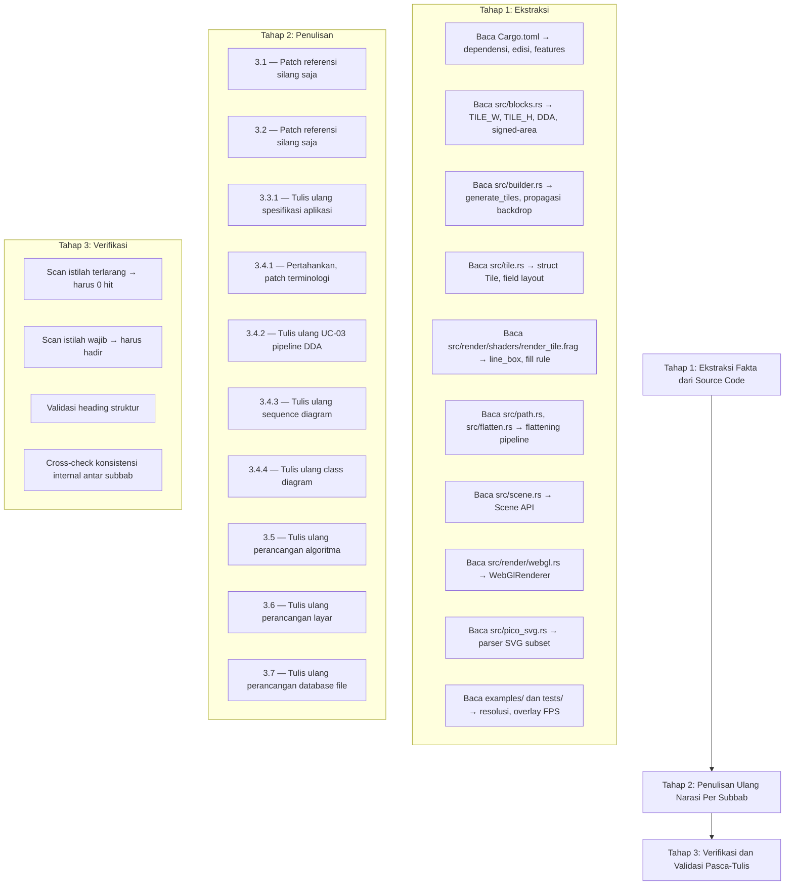
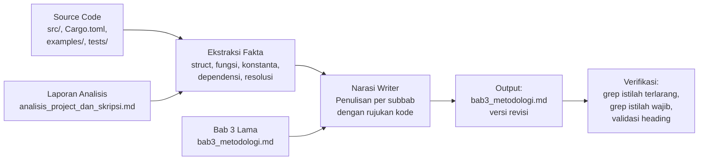

# Design Document: Revisi Bab 3 Metodologi

## Overview

Dokumen desain ini mendeskripsikan pendekatan sistematis untuk menulis ulang `Skripsi/bab3_metodologi.md` agar seluruh klaim teknis pada Bab 3 selaras dengan implementasi aktual pustaka Arabella di `src/`, `Cargo.toml`, `examples/`, dan `tests/`. Output akhir adalah satu berkas Markdown tunggal yang menggantikan versi lama secara in-place.

Pendekatan revisi mengikuti prinsip **source-of-truth-driven writing**: setiap klaim teknis ditulis berdasarkan pembacaan langsung terhadap kode sumber, bukan berdasarkan narasi lama. Proses revisi dibagi menjadi tiga tahap besar: (1) ekstraksi fakta dari source code, (2) penulisan ulang narasi per subbab, dan (3) verifikasi pasca-tulis untuk memastikan eliminasi istilah terlarang dan kehadiran istilah wajib.

### Keputusan Desain Utama

1. **Revisi minimal-invasif pada Subbab 3.1 dan 3.2** — Konten dipertahankan kecuali referensi silang yang merujuk algoritma lama (ray shooting, klasifikasi tipe ubin).
2. **Rewrite total pada Subbab 3.3.1, 3.4.2, 3.4.3, 3.4.4, 3.5, 3.6, dan 3.7** — Narasi ditulis ulang dari nol berdasarkan source code.
3. **Rujukan kode inline** — Setiap klaim teknis disertai rujukan berformat `berkas:simbol` atau `berkas:start-end`.
4. **Gaya bahasa** — Mempertahankan bahasa akademik formal Indonesia, kalimat lengkap S-P-O, tanpa singkatan kasual.

## Architecture

Arsitektur proses revisi terdiri dari pipeline tiga tahap yang dieksekusi secara sekuensial:



### Aliran Data



## Components and Interfaces

### Komponen 1: Ekstraktor Fakta Source Code

**Tanggung jawab:** Membaca berkas-berkas source code dan mengekstrak fakta teknis yang akan menjadi basis penulisan.

**Input:** Berkas-berkas di `src/`, `Cargo.toml`, `examples/`, `tests/`

**Output:** Daftar fakta terstruktur per subbab target, meliputi:
- Nama struct, field, dan tipe data
- Nama fungsi dan signature
- Nilai konstanta numerik
- Nama crate dependensi dan versinya
- Resolusi kanvas dan metrik overlay

**Pemetaan berkas → subbab:**

| Berkas Sumber | Subbab Target | Fakta yang Diekstrak |
|---|---|---|
| `Cargo.toml` | 3.3.1 | edition, dependencies, features, target |
| `src/pico_svg.rs` | 3.3.1, 3.4.4 | Elemen SVG yang didukung, struct PicoSvg |
| `src/path.rs` | 3.5 | `convert_cubics_to_quadratic_curves`, `estimate_number_of_quadratic_curves` |
| `src/flatten.rs` | 3.5 | Midpoint subdivision, De Casteljau |
| `src/blocks.rs` | 3.4.2, 3.5 | `TILE_W=16`, `TILE_H=8`, `bin_line`, `Blocks::build_block`, `record_per_scanline_crossings`, outer/inner DDA |
| `src/builder.rs` | 3.4.2, 3.4.3, 3.5 | `Builder::build_path`, `Builder::generate_tiles`, propagasi backdrop |
| `src/tile.rs` | 3.4.4, 3.7 | Struct `Tile` (44 byte, `#[repr(C)]`), field layout |
| `src/scene.rs` | 3.4.3, 3.4.4 | `Scene::fill`, `Scene::stroke`, field `builder` |
| `src/render/webgl.rs` | 3.4.3, 3.4.4, 3.7 | `WebGlRenderer::new`, `WebGlRenderer::render`, `initialize_tile_vao` |
| `src/render/shaders/render_tile.frag` | 3.4.2, 3.5 | `line_box`, fill rule NonZero/EvenOdd, WINDING_UNIT=256 |
| `examples/native_webgl/src/main.rs` | 3.6 | Resolusi DPR-aware |
| `examples/native_webgl/src/lib.rs` | 3.6 | `update_overlay`, metrik FPS |
| `tests/test.rs` | 3.6 | `W=1080`, `H=520` |

### Komponen 2: Penulis Narasi Per Subbab

**Tanggung jawab:** Menulis ulang konten setiap subbab berdasarkan fakta yang diekstrak, dengan memperhatikan:
- Eliminasi seluruh istilah terlarang
- Penyisipan istilah wajib pada konteks yang tepat
- Penyertaan rujukan kode pada setiap klaim teknis
- Konsistensi terminologi kanonik antar subbab

**Strategi penulisan per subbab:**

| Subbab | Strategi |
|---|---|
| 3.1 | Pertahankan teks lama. Ganti penyebutan "ray shooting" dan "klasifikasi tipe ubin" dengan "binning DDA", "akumulator signed-area", "propagasi backdrop". |
| 3.2 (3.2.1, 3.2.2, 3.2.3) | Pertahankan teks lama. Ganti penyebutan "Ray Shooting" di tabel 3.2.3 dengan deskripsi pipeline aktual. |
| 3.3.1 | Tulis ulang total: Rust edisi 2024, WebGL 2.0 langsung, 10 crate wajib, Rayon opsional, subset SVG minimal. |
| 3.4.1 | Pertahankan struktur UC. Ganti sub-proses "Ray Shoot" dengan "Binning DDA & Akumulasi Signed-Area". |
| 3.4.2 | Tulis ulang UC-03: 6 tahap CPU + 2 tahap GPU tanpa percabangan tipe ubin. |
| 3.4.3 | Tulis ulang sequence diagram: 5 partisipan, 5 tahap berurutan, tanpa blok alt tipe ubin. |
| 3.4.4 | Tulis ulang class diagram: 9 kotak kelas UML berdasarkan struct aktual. |
| 3.5 | Tulis ulang total: 6 sub-bagian algoritma (flattening, binning DDA, signed-area, backdrop, line_box GPU, fill rule). |
| 3.6 | Tulis ulang: resolusi DPR-aware, kanvas tes 1080×520, overlay FPS 4 metrik. |
| 3.7 | Tulis ulang: Vec<Tile> 44 byte, tekstur RGBA32F, vertex buffer instanced 44 byte/tile. |

### Komponen 3: Validator Pasca-Tulis

**Tanggung jawab:** Memverifikasi bahwa berkas output memenuhi seluruh constraint requirements.

**Prosedur validasi:**

1. **Validasi Istilah Terlarang (Req 3):** Jalankan pencarian regex case-insensitive untuk setiap istilah terlarang. Kondisi PASS = 0 kemunculan.
2. **Validasi Istilah Wajib (Req 4, 5, 8):** Jalankan pencarian untuk setiap istilah wajib. Kondisi PASS = minimal 1 kemunculan pada subbab yang tepat.
3. **Validasi Heading Struktur (Req 2):** Verifikasi kehadiran dan urutan seluruh heading wajib.
4. **Validasi Konsistensi Internal (Req 11):** Cross-check bahwa istilah kanonik ("binning DDA", "akumulator signed-area", "propagasi backdrop", "fragment shader") digunakan secara konsisten tanpa sinonim.
5. **Validasi Rujukan Kode (Req 13):** Verifikasi bahwa setiap klaim teknis memiliki rujukan kode yang menunjuk berkas yang ada di repositori.

## Data Models

### Model 1: Fakta Teknis (Intermediate Representation)

Setiap fakta yang diekstrak dari source code direpresentasikan sebagai tuple:

```
FaktaTeknis {
    subbab_target: String,        // e.g. "3.5", "3.4.2"
    kategori: enum {Algoritma, StrukturData, Parameter, Fungsi, Dependensi, Perilaku},
    klaim_naratif: String,        // Kalimat yang akan ditulis di Bab 3
    rujukan_kode: String,         // e.g. "src/blocks.rs:TILE_W"
    berkas_sumber: String,        // Path relatif ke berkas yang membuktikan klaim
}
```

### Model 2: Struktur Heading Bab 3

```
HeadingTree {
    level_1: "# BAB 3 METODE PENELITIAN"
    children: [
        {level_2: "## 3.1 Diagram Alir Kerangka Berpikir"},
        {level_2: "## 3.2 Analisis Kebutuhan", children: [
            {level_3: "### 3.2.1 Analisis User"},
            {level_3: "### 3.2.2 Analisis Aplikasi Sejenis"},
            {level_3: "### 3.2.3 Rumusan dan Solusi Kebutuhan"},
        ]},
        {level_2: "## 3.3 Perancangan Aplikasi", children: [
            {level_3: "### 3.3.1 Spesifikasi Aplikasi"},
        ]},
        {level_2: "## 3.4 Perancangan Sistem", children: [
            {level_3: "### 3.4.1 Use Case Diagram"},
            {level_3: "### 3.4.2 Use Case Description"},
            {level_3: "### 3.4.3 Sequence Diagram"},
            {level_3: "### 3.4.4 Class Diagram"},
        ]},
        {level_2: "## 3.5 Perancangan Algoritma"},
        {level_2: "## 3.6 Perancangan Layar"},
        {level_2: "## 3.7 Perancangan Database File"},
    ]
}
```

### Model 3: Pemetaan Istilah Terlarang → Pengganti

| Istilah Terlarang | Pengganti di Narasi Baru |
|---|---|
| Ray Shooting / ray shoot | Binning DDA dua tahap + akumulator signed-area per scanline |
| EMPTY / INTERIOR / EDGE (sebagai tipe ubin) | Ubin nontrivial (memiliki segmen atau backdrop non-nol) vs ubin trivial (tidak diemit) |
| TileType | (dihapus, tidak ada enum tipe ubin) |
| winding_number (field skalar Tile) | backdrop (array 8 elemen i16 per scanline) |
| fungsi implisit linear ax+by+c | Integral trapezoidal cakupan piksel (`line_box`) |
| fungsi implisit kuadratik f(u,v)=u-v² | Flattening kuadratik ke segmen garis di CPU |
| fungsi implisit kubik PPGA | Konversi kubik→kuadratik→garis di CPU |
| C(x,y)=0 | Akumulasi winding per piksel melalui `line_box` |
| OpenGL ES 3.0 ditranspilasikan ke WebGL 2.0 | WebGL 2.0 sebagai target langsung |
| Rust edisi 2021 | Rust edisi 2024 |

### Model 4: Istilah Kanonik untuk Konsistensi Internal

| Komponen Pipeline | Istilah Kanonik Tunggal |
|---|---|
| Pemecahan segmen lintas ubin | binning DDA |
| Akumulator winding 8.8 fixed-point per scanline | akumulator signed-area |
| Akumulasi kiri-ke-kanan saat emisi tile | propagasi backdrop |
| Shader piksel WebGL | fragment shader |
| Tahap CPU keseluruhan | pra-pemrosesan |
| Arsitektur keseluruhan | pipeline hibrida |
| Pipeline GPU | rasterization pipeline tradisional |
| Wilayah layar target | viewport |

## Correctness Properties

*A property is a characteristic or behavior that should hold true across all valid executions of a system — essentially, a formal statement about what the system should do. Properties serve as the bridge between human-readable specifications and machine-verifiable correctness guarantees.*

Spec ini menghasilkan satu berkas Markdown akademik (bukan kode yang dapat dieksekusi), sehingga properti di bawah ini tidak diuji melalui property-based testing dengan iterasi acak. Sebaliknya, setiap properti diformulasikan sebagai pernyataan terkuantifikasi universal terhadap konten berkas `Skripsi/bab3_metodologi.md` dan struktur repositori, dan diverifikasi secara deterministik melalui pencarian teks (regex) dan pemeriksaan struktural pada satu dokumen output. Setiap properti dirancang agar dapat dievaluasi sebagai predikat boolean PASS/FAIL.

### Property 1: Absence of Forbidden Terms

*For all* istilah terlarang `T` pada himpunan `Istilah_Terlarang` (didefinisikan di Glossary requirements), `T` TIDAK muncul pada konten `Skripsi/bab3_metodologi.md` dalam konteks yang dilarang. Pemeriksaan mencakup pencarian case-insensitive untuk `Ray Shooting`, `Ray Shoot`, `ray shooting`, `ray shoot`; pencarian token kata utuh case-sensitive untuk `TileType`, `winding_number`, `PPGA`, `Projective Geometric Algebra`; pencarian token kata utuh case-sensitive untuk `EMPTY`, `INTERIOR`, `EDGE` ketika digunakan sebagai label tipe ubin; pencarian frasa untuk `fungsi implisit linear`, `fungsi implisit kuadratik kanonik`, `fungsi implisit kubik`, `OpenGL ES 3.0 yang ditranspilasikan`, `ditranspilasikan ke WebGL`, `transpilasi OpenGL ES`, `Rust edisi 2021`, `edisi 2021`, `edition = "2021"`; serta pencarian persamaan untuk seluruh varian `ax+by+c=0`, `u-v²=0`, `u-v^2=0`, `C(x,y)=0`, dan `w_0³-w_1 w_2 w_3` dengan atau tanpa spasi.

**Validates: Requirements 3.1, 3.2, 3.3, 3.4, 3.5, 3.6, 3.7, 3.8, 3.9, 3.10, 3.11, 8.1, 11.2**

### Property 2: Presence of Required Terms

*For every* istilah wajib `T` pada himpunan `Istilah_Wajib` (didefinisikan di Glossary requirements), `T` muncul minimal satu kali pada `Skripsi/bab3_metodologi.md`, dan setiap istilah yang terikat pada subbab tertentu (misalnya nama crate pada Subbab 3.3.1, `line_box` pada Subbab 3.5, `1080×520` pada Subbab 3.6) muncul minimal satu kali pada subbab tersebut. Himpunan mencakup `WebGL 2.0`, `Rust edisi 2024`, `F24Dot8` (atau `24.8 fixed-point`), `8.8 fixed-point`, `DDA`, `outer DDA`, `inner DDA`, `signed-area`, `backdrop`, `propagasi backdrop`, `flattening`, `midpoint subdivision`, `cubic-to-quadratic`, `line_box`, `trapezoidal`, `fearless_simd`, `lyon_path`, `lyon_geom`, `kurbo`, `peniko`, `roxmltree`, `bytemuck`, `thiserror`, `hashbrown`, `smallvec`, `NonZero`, `EvenOdd`, `16×8`, dan `Rayon`.

**Validates: Requirements 4.1, 4.2, 4.3, 4.4, 5.1, 5.2, 5.5, 8.2, 8.3, 8.7**

### Property 3: Structural Heading Invariant

*For every* heading `H` pada himpunan `Subbab_Wajib` (`3.1 Diagram Alir Kerangka Berpikir`, `3.2 Analisis Kebutuhan`, `3.2.1 Analisis User`, `3.2.2 Analisis Aplikasi Sejenis`, `3.2.3 Rumusan dan Solusi Kebutuhan`, `3.3 Perancangan Aplikasi`, `3.3.1 Spesifikasi Aplikasi`, `3.4 Perancangan Sistem`, `3.4.1 Use Case Diagram`, `3.4.2 Use Case Description`, `3.4.3 Sequence Diagram`, `3.4.4 Class Diagram`, `3.5 Perancangan Algoritma`, `3.6 Perancangan Layar`, `3.7 Perancangan Database File`), `H` muncul tepat satu kali pada level Markdown yang ditentukan (`##` untuk subbab `3.X`, `###` untuk subbab `3.X.Y`) dengan teks persis case-sensitive yang ditetapkan; baris pertama berkas adalah `# BAB 3 METODE PENELITIAN`; nomor heading level 2 mengikuti urutan menaik monotonik 3.1 → 3.7 tanpa lompatan, pengulangan, atau pembalikan; dan setiap subheading `### 3.X.Y` muncul setelah induknya `## 3.X` dan sebelum `## 3.(X+1)` dengan `Y` menaik monotonik mulai dari 1.

**Validates: Requirements 1.4, 2.1, 2.2, 2.3, 2.4, 2.5, 2.6, 2.7, 2.8, 2.9**

### Property 4: Canonical Terminology Consistency

*For every* komponen pipeline `C` pada himpunan istilah kanonik (didefinisikan di Data Model 4: `binning DDA`, `akumulator signed-area`, `propagasi backdrop`, `fragment shader`, `pra-pemrosesan` atau `preprocessing`, `pipeline hibrida`, `rasterization pipeline tradisional` atau `pipeline rasterisasi konvensional`, `viewport`, `winding number`), setiap kemunculan `C` di seluruh `Skripsi/bab3_metodologi.md` menggunakan bentuk kanonik tersebut; tidak ada sinonim non-kanonik atau variasi ejaan untuk `C` yang muncul di subbab manapun; dan untuk `pra-pemrosesan` versus `preprocessing`, tidak ada satu paragraf tunggal yang mencampur kedua varian.

**Validates: Requirements 11.1, 11.4, 12.1, 12.2, 12.3, 12.4, 12.5, 12.6**

### Property 5: Technical Claim Traceability

*For every* klaim teknis `K` di `Skripsi/bab3_metodologi.md` (sesuai definisi AC 13.1: pernyataan yang menyebut nama algoritma/struktur data, parameter numerik konkret, nama berkas/fungsi/struct/trait/modul/konstanta, atau perilaku runtime), terdapat minimal satu rujukan kode `R` yang menyertai `K` dalam kalimat atau paragraf yang sama, dengan format jalur berkas relatif terhadap akar repositori ditambah salah satu dari nama fungsi, nama konstanta, nama struct, atau rentang baris (`path:start-end`); dan untuk setiap `R` tersebut, berkas yang ditunjuk benar-benar ada di salah satu dari `src/`, `Cargo.toml`, `.cargo/config.toml`, `examples/*/src/`, `tests/`, atau `assets/`, dan simbol yang dirujuk benar-benar terdefinisi pada berkas tersebut.

**Validates: Requirements 13.1, 13.2, 13.3, 13.4, 13.5, 13.6, 13.7, 13.8, 13.9, 13.10, 13.11, 13.12, 15.1, 15.2, 15.3, 15.4, 15.5**

### Property 6: Cross-Subsection Narrative Consistency

*For every* komponen pipeline `C` yang disebut pada Subbab 3.4.2 (UC-03), Subbab 3.4.3 (Sequence Diagram), Subbab 3.4.4 (Class Diagram), dan Subbab 3.5 (Perancangan Algoritma), deskripsi peran, urutan tahap, dan penamaan `C` setara di keempat subbab tersebut tanpa kontradiksi: tidak ada subbab yang menyebut percabangan tipe ubin (`alt: Tipe == EDGE`, `Render Warna Solid`, `Tandai Tipe: INTERIOR`, atau varian setara) sementara subbab lain menggambarkan jalur kode tunggal; tidak ada subbab yang menampilkan field `winding_number` skalar atau enum `TileType` sementara subbab lain mendeklarasikan `backdrop` array delapan elemen; dan urutan tahap pipeline (flattening → outer DDA → inner DDA → akumulasi signed-area → emisi ubin → propagasi backdrop → vertex shader → fragment shader) identik di setiap subbab tempat urutan tersebut disebutkan.

**Validates: Requirements 5.1, 5.2, 5.3, 6.1, 6.2, 6.3, 6.4, 6.5, 7.1, 7.3, 11.1, 11.2, 11.3, 11.4**

### Property 7: Numerical Claim Consistency

*For every* parameter numerik berulang `P` pada himpunan klaim numerik kanonik (dimensi ubin Arabella = `16×8` piksel; ukuran rekord `Tile` = 44 byte; resolusi kanvas pengujian wasm-bindgen-test = `1080×520` piksel; format tekstur segmen = `RGBA32F`; format fixed-point segmen = `F24Dot8`; format fixed-point akumulator winding = `8.8` fixed-point), setiap kemunculan `P` di seluruh `Skripsi/bab3_metodologi.md` melaporkan nilai yang sama, dan tidak ada nilai kontradiktif (misalnya `16×16` untuk dimensi ubin, `1920×1080` untuk resolusi pengujian default, atau ukuran `Tile` selain 44 byte) yang muncul di subbab manapun.

**Validates: Requirements 8.3, 8.4, 9.1, 9.2, 9.3, 9.4, 10.1, 10.2, 10.3, 10.4**

### Property 8: Single-File Output Identity

*For all* jalur berkas di repositori yang nama berkasnya mengandung substring `bab3`, `bab_3`, atau `bab-3` (pencocokan case-insensitive), satu-satunya berkas yang baris pertamanya adalah literal `# BAB 3 METODE PENELITIAN` adalah `Skripsi/bab3_metodologi.md`; dan tidak ada salinan utuh, salinan parsial, cadangan, atau draf alternatif Bab 3 di lokasi lain manapun pada repositori.

**Validates: Requirements 1.1, 1.2, 1.3, 1.5**

## Error Handling

### Skenario Kesalahan dan Mitigasi

| Skenario | Dampak | Mitigasi |
|---|---|---|
| Klaim teknis tidak dapat diverifikasi ke source code | Klaim fabrikasi masuk ke dokumen final | Hapus klaim atau ganti dengan pernyataan yang dapat diverifikasi (Req 15 AC 2) |
| Istilah terlarang lolos ke dokumen final | Inkonsistensi dengan source code | Jalankan validasi regex pasca-tulis; iterasi sampai 0 hit |
| Istilah wajib tidak muncul di subbab yang tepat | Dokumen tidak mencerminkan implementasi | Checklist istilah wajib per subbab sebelum finalisasi |
| Heading subbab salah urutan atau hilang | Melanggar panduan akademik kampus | Validasi otomatis urutan heading sebelum finalisasi |
| Sinonim non-kanonik digunakan antar subbab | Ambiguitas bagi pembaca | Cross-check terminologi kanonik pada Tahap 3 validasi |
| Ukuran ubin disebut 16×16 (dari narasi lama) | Kontradiksi dengan TILE_W=16, TILE_H=8 | Search-and-replace global; validasi bahwa "16×16" tidak muncul |
| Referensi silang dari 3.1/3.2 merujuk algoritma lama | Inkonsistensi lintas subbab | Patch referensi silang di 3.1 dan 3.2 setelah rewrite 3.5 |

### Strategi Rollback

Karena output adalah satu berkas Markdown yang menggantikan versi lama secara in-place, strategi rollback adalah:
- Versi lama tersimpan di git history (commit pra-revisi)
- Jika validasi pasca-tulis gagal, iterasi revisi dilakukan pada berkas yang sama sampai seluruh constraint terpenuhi

## Testing Strategy

### Mengapa Property-Based Testing Tidak Berlaku

Spec ini menghasilkan dokumen naratif akademik (berkas Markdown), bukan kode yang dapat dieksekusi. Tidak ada fungsi murni dengan input/output yang dapat diuji secara universal. Acceptance criteria bersifat verifikasi konten dokumen (kehadiran/ketiadaan string, urutan heading, konsistensi terminologi), yang lebih tepat divalidasi melalui pencarian teks deterministik.

### Strategi Verifikasi yang Digunakan

**1. Validasi Struktural (Req 1, 2)**
- Verifikasi baris pertama = `# BAB 3 METODE PENELITIAN`
- Verifikasi kehadiran dan urutan seluruh heading wajib menggunakan regex
- Verifikasi tidak ada berkas lain dengan heading Bab 3

**2. Validasi Eliminasi Istilah Terlarang (Req 3)**
- Pencarian case-insensitive: `ray shooting`, `ray shoot`
- Pencarian case-sensitive: `EMPTY`, `INTERIOR`, `EDGE` (dalam konteks tipe ubin), `TileType`, `winding_number` (dengan underscore), `ax+by+c`, `u-v²`, `PPGA`, `C(x,y)=0`, `OpenGL ES 3.0 yang ditranspilasikan`, `edisi 2021`
- Kondisi PASS: 0 kemunculan pada konteks yang dilarang

**3. Validasi Kehadiran Istilah Wajib (Req 4, 5, 8)**
- Pencarian kehadiran: `WebGL 2.0`, `Rust edisi 2024`, `F24Dot8`, `8.8 fixed-point`, `DDA`, `outer DDA`, `inner DDA`, `signed-area`, `backdrop`, `flattening`, `midpoint subdivision`, `cubic-to-quadratic`, `line_box`, `trapezoidal`, `fearless_simd`, `lyon_path`, `lyon_geom`, `kurbo`, `peniko`, `roxmltree`, `bytemuck`, `thiserror`, `hashbrown`, `smallvec`, `NonZero`, `EvenOdd`, `16×8`, `Rayon`
- Kondisi PASS: minimal 1 kemunculan per istilah

**4. Validasi Rujukan Kode (Req 13)**
- Untuk setiap klaim teknis, verifikasi bahwa rujukan kode menunjuk berkas yang ada di repositori
- Verifikasi bahwa simbol yang dirujuk (fungsi, struct, konstanta) benar-benar ada di berkas tersebut

**5. Validasi Konsistensi Internal (Req 11, 12)**
- Verifikasi bahwa istilah kanonik digunakan secara konsisten
- Verifikasi tidak ada sinonim non-kanonik untuk komponen pipeline yang sama
- Cross-check bahwa UC-03, sequence diagram, class diagram, dan algoritma merujuk objek dan langkah yang sama

**6. Validasi Konsistensi Numerik (Req 8, 9, 10)**
- Verifikasi ukuran ubin = 16×8 di seluruh dokumen
- Verifikasi resolusi tes = 1080×520
- Verifikasi ukuran Tile = 44 byte
- Verifikasi format tekstur = RGBA32F

### Urutan Eksekusi Validasi

1. Tulis seluruh subbab
2. Jalankan validasi struktural (heading)
3. Jalankan validasi istilah terlarang
4. Jalankan validasi istilah wajib
5. Jalankan validasi rujukan kode
6. Jalankan validasi konsistensi internal
7. Jika ada kegagalan, iterasi revisi pada bagian yang gagal
8. Ulangi validasi sampai seluruh constraint PASS
